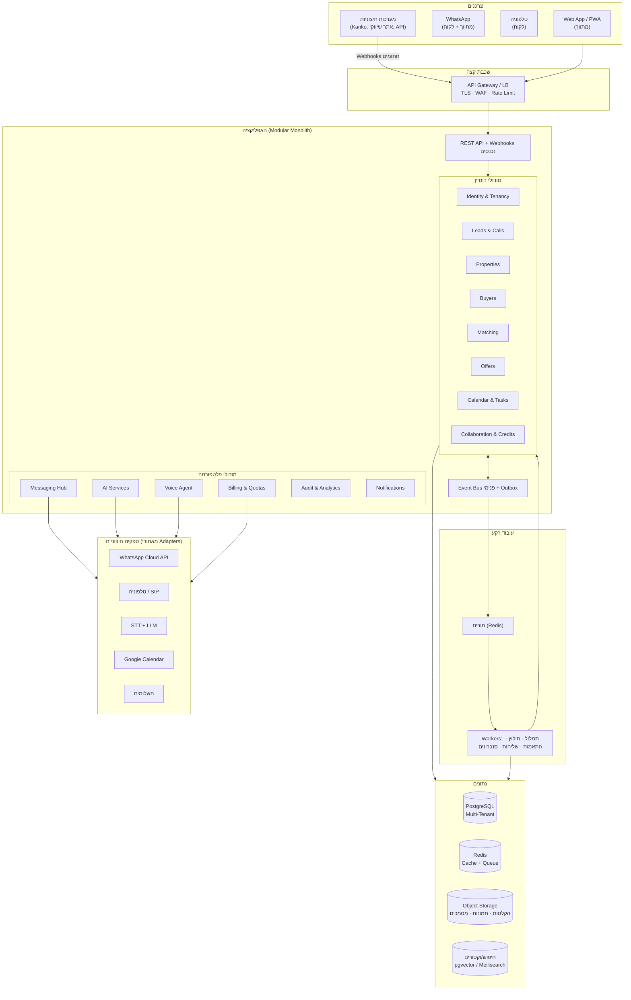
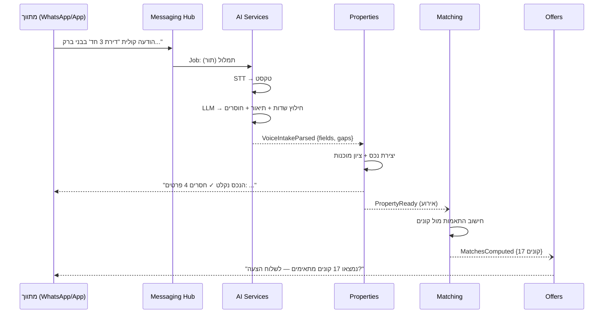

# 02 · ארכיטקטורה

## 1. תמונה כללית

**Modular Monolith, API-First, Event-Driven** — אפליקציה אחת פרוסה, מחולקת פנימית למודולים עם גבולות נוקשים, שמתקשרים דרך חוזים (Interfaces) ואירועי דומיין. עבודות כבדות (תמלול, התאמות, שליחות) רצות בתורים ברקע.



## 2. למה Modular Monolith (ולא Microservices)

- צוות קטן-בינוני: מונוליט מודולרי = מהירות פיתוח מקסימלית, Deploy אחד, דיבוג פשוט.
- הגבולות הפנימיים (מודול = חבילה עם API פנימי + אירועים) הם **אותם גבולות** שיאפשרו לחלץ שירות נפרד בעתיד (המועמדים הטבעיים: Voice Agent, Matching) — בלי לשכתב.
- הכלל המחייב: **מודול לא ניגש לטבלאות של מודול אחר** — רק דרך ה-API הפנימי או אירועים. נאכף ב-Code Review ובבדיקת ארכיטקטורה אוטומטית (deptrac או מקבילה).

ראו [ADR-001](adr/ADR-001-modular-monolith.md).

## 3. סטאק טכנולוגי מומלץ

| שכבה | בחירה | נימוק |
|------|-------|-------|
| Backend | **PHP 8.3 + Laravel 11** | מנצל את מומחיות ה-PHP הקיימת של הצוות; אקוסיסטם בשל: Queues, Scheduler, Policies, Sanctum, Cashier; Modular עם php-artisan modules או מבנה Domain |
| Frontend | **Vue 3 + Inertia.js (PWA)** | SPA-חוויה בלי לתחזק API-Client כפול; RTL מלא; PWA להתקנה במובייל |
| DB | **PostgreSQL 16** | RLS לבידוד דיירים, JSONB לשדות גמישים, pgvector להתאמות סמנטיות |
| Cache/Queue | **Redis** | Cache, תורים (Laravel Horizon), Rate Limiting, Locks |
| Storage | **S3-compatible** | הקלטות, תמונות, מסמכים — עם URL חתומים בלבד |
| חיפוש | **pgvector בהתחלה; Meilisearch אם יידרש** | לא להוסיף רכיב תשתית לפני שיש צורך מוכח |
| Realtime | **Laravel Reverb (WebSockets)** | התראות חיות בדשבורד ("קונה פתח הצעה") |

> חלופה שקולה: NestJS + Next.js אם יגויס צוות Node. ההחלטה תלוית-צוות; כל שאר המסמכים אגנוסטיים לשפה. ראו [ADR-002](adr/ADR-002-tech-stack.md).

## 4. מפת מודולים וגבולות

### מודולי דומיין

| מודול | אחריות | חושף | מאזין ל- |
|-------|--------|------|----------|
| **Identity & Tenancy** | סוכנויות (Tenants), משתמשים, תפקידים, הרשאות, הזמנות, 2FA | `TenantContext`, `can()` | — |
| **Leads & Calls** | ליד מכל ערוץ, ציר זמן תקשורת, תמלולים, סטטוסים | `LeadCreated`, `CallSummarized` | הודעות נכנסות, שיחות |
| **Properties** | כרטיס נכס, מדיה, ציון מוכנות, סטטוסים | `PropertyCreated/Updated/Ready` | `VoiceIntakeParsed` |
| **Buyers** | פרופיל קונה, דרישות, בשלות, היסטוריה | `BuyerCreated/Updated` | `LeadQualified` |
| **Matching** | חישוב התאמות דו-כיווני, ניקוד, הסברים | `MatchesComputed` | `PropertyReady`, `BuyerUpdated` |
| **Offers** | הצעות, דפי הצעה, מעקב פתיחות/עניין | `OfferSent/Opened/Interested` | `MatchesComputed` |
| **Calendar & Tasks** | פגישות, סיורים, משימות, תזכורות, סנכרון Google | `AppointmentScheduled` | `OfferInterested`, `CallbackRequested` |
| **Collaboration** | ביקושים אנונימיים, הצעות בין סוכנויות, חיבורים, לידים מ-Kanko | `CoopOfferSent`, `ConnectionApproved` | `BuyerShared` |

### מודולי פלטפורמה

| מודול | אחריות |
|-------|--------|
| **Messaging Hub** | ערוץ יוצא/נכנס אחוד: WhatsApp (ראשי), SMS, Email. תבניות, חלון 24h, Opt-out, ניתוב הודעות נכנסות למודול הנכון |
| **AI Services** | שער יחיד ל-LLM/STT: תמלול, חילוץ שדות מובנים, ניסוח תיאורים, סיכומי שיחה, המלצות. כולל Prompt Registry, מדידת עלות, Fallback בין ספקים |
| **Voice Agent** | ניהול שיחה קולית בזמן אמת: מכונת מצבים לשיחה, גישה לנתוני נכסים דרך API פנימי, כללי אסקלציה לאדם |
| **Billing & Quotas** | מנויים, מסלולים, קרדיטים, מכסות (דקות/הודעות), Feature Flags לפי מסלול |
| **Audit & Analytics** | לוג ביקורת בלתי-ניתן-לשינוי, אירועי שימוש, דוחות |
| **Notifications** | התראות למתווך: In-App (WebSocket), WhatsApp, Push, Email — לפי העדפות |

## 5. תקשורת בין מודולים

1. **סינכרוני** — קריאה ל-Interface ציבורי של מודול אחר (`PropertiesApi::getForMatching()`). אסור לקרוא Models/Tables של מודול זר.
2. **אסינכרוני** — אירועי דומיין דרך Event Bus. כל אירוע נכתב קודם לטבלת **Outbox** באותה טרנזקציה עם השינוי, ו-Worker מפיץ אותו — כך אין אירועים אבודים ואין חצאי-מצב.
3. **כלל זהב**: אם מודול צריך נתון של מודול אחר בתדירות גבוהה — הוא מחזיק **Read Model** מקומי שמתעדכן מאירועים, לא שולף בזמן אמת.

### דוגמה: זרימת "נכס חדש בקול"



## 6. עקרונות הרחבה (Extensibility)

- **Connector SDK פנימי**: כל אינטגרציה (Kanko, פורטל עתידי, מקור לידים) מממשת ממשק אחיד — `receiveLead()`, `verifySignature()`, `mapToDomain()`. הוספת מקור לידים חדש = קובץ Connector אחד + רישום, אפס נגיעה בליבה.
- **Provider Adapters**: WhatsApp/טלפוניה/STT/LLM מאחורי ממשק. החלפת ספק = מימוש Adapter חדש + שינוי קונפיג.
- **Feature Flags**: לכל פיצ'ר חדש דגל, נשלט ברמת מסלול/דייר. מאפשר הדלקה הדרגתית, בטא לדיירים נבחרים, וכיבוי מיידי בתקלה.
- **Webhooks יוצאים + API ציבורי (שלב Enterprise)**: אירועי דומיין נבחרים ניתנים למנוי חיצוני — זה מה שיאפשר לאתר השיווקי ולשותפים להתחבר בלי פיתוח ייעודי.
- **גרסאות API**: `/api/v1/...` מהיום הראשון; שינוי שובר = גרסה חדשה, לא שינוי שקט.

## 7. מבנה ריפו מוצע

```
app/
  Modules/
    Identity/        # כל מודול: Domain/ Application/ Infrastructure/ Http/
    Leads/
    Properties/
    Buyers/
    Matching/
    Offers/
    Calendar/
    Collaboration/
  Platform/
    Messaging/
    AI/
    Voice/
    Billing/
    Audit/
    Notifications/
  Shared/            # Value Objects, TenantContext, Event Bus, חוזים
frontend/            # Vue 3 + Inertia
docs/                # המסמכים האלה
tests/               # Unit לפי מודול, Feature חוצה-מודולים, Architecture tests
```
