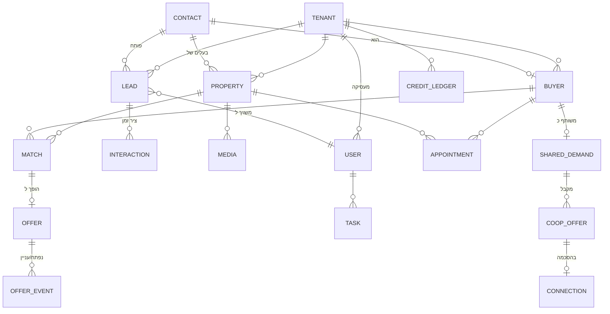

# 03 · מודל נתונים

## 1. עקרונות

1. **Multi-Tenant בבסיס נתונים משותף**: לכל טבלה עסקית עמודת `tenant_id` (הסוכנות). בידוד נאכף בשלוש שכבות — Global Scope באפליקציה, Policy בכל Endpoint, ו-**Row-Level Security ב-PostgreSQL** כקו הגנה אחרון (גם באג באפליקציה לא ידלוף דאטה בין סוכנויות). ראו [ADR-003](adr/ADR-003-multi-tenancy.md).
2. **מזהים**: ULID לכל הישויות (ממוין-זמן, לא חושף נפח פעילות, ידידותי לאינדקסים).
3. **שדות מובנים + JSONB**: מאפייני נכס/דרישות קונה הנפוצים = עמודות אמיתיות (ניתנות לאינדוקס והתאמה); מאפיינים נדירים/עתידיים = `attributes JSONB`. כך מוסיפים מאפיין בלי מיגרציה.
4. **Soft Delete + היסטוריה**: ישויות ליבה לא נמחקות פיזית; שינויים מהותיים נרשמים ב-Audit.
5. **PII מוצפן**: טלפון, אימייל ושם של לקוחות קצה מוצפנים ברמת עמודה (ראו מסמך 04); חיפוש לפי טלפון דרך עמודת hash.

## 2. תרשים ישויות מרכזי

## 3. ישויות עיקריות

### Identity & Tenancy
- **tenants** — סוכנות: שם, מסלול, סטטוס, הגדרות (JSONB: מיתוג, שעות פעילות, שפה), `kanko_enabled`, הגדרות שיתוף.
- **users** — סוכן/מנהל: שייך ל-tenant, תפקיד, טלפון (לוואטסאפ פנימי), העדפות התראה, 2FA.
- **roles / permissions** — RBAC מבוסס Capabilities (ראו מסמך 04).

### CRM
- **contacts** — אדם אמיתי אחד (טלפון מנורמל = מפתח ייחודי לכל דייר): שם, טלפונים, אימייל, `phone_hash` לחיפוש. קונה, מוכר וליד מפנים לאותו contact — אין כפילויות אדם.
- **leads** — פנייה: מקור (voice/whatsapp/web/kanko/manual), כוונה (buy/sell/info), סטטוס (new/in_progress/waiting/converted/closed), `requires_human` + סיבה, שיוך לסוכן, SLA timestamps.
- **interactions** — ציר זמן אחוד: שיחה (עם קישור להקלטה+תמלול+סיכום), הודעת וואטסאפ, פגישה, הערה. `interaction_type`, `direction`, `payload JSONB`.

### נכסים
- **properties** — עיר, שכונה, רחוב, סוג, חדרים, מ"ר, קומה/מתוך, מחיר + גמישות, תאריך כניסה, בלעדיות (+תוקף), סטטוס (draft/active/on_hold/sold/rented/archived), בוליאנים נפוצים (מעלית, חניה, ממ"ד, מרפסת, מחסן), מצב הנכס, `attributes JSONB`, `readiness_score` (0–100, מחושב), `marketing_title`, `marketing_description`, `owner_contact_id`, הערות פנימיות.
- **property_media** — תמונות/מסמכים: S3 key, סוג, סדר, alt text.
- **voice_intakes** — הקלטת קליטה: קובץ, תמלול, שדות שחולצו, שדות חסרים, סטטוס עיבוד. נשמר לצורך שחזור ותיקון.
- **intake_requests** — הטופס שהלקוח ממלא בעצמו: טוקן (43 תווים, ייחודי גלובלית — הוא נפתר לפני שידוע הדייר), הכרטיס שאליו הוא מצביע, סטטוס, תפוגה, ומה שהלקוח שלח (`answers`). `side` הוא **לאיזה צד של העסקה הוא נענה** — `buyer` או `seller` — ונשמר על השורה ולא נגזר מהתשובות, כדי שלקוח שפותח את הקישור שוב כדי לתקן יחזור למסלול שבו כבר היה. `property_id` הוא טיוטת הנכס שהמוכר יצר, ובלעדיו שליחה חוזרת הייתה פותחת נכס שני לאותה דירה.

### קונים
- **buyers** — מקושר ל-contact: ערים/שכונות מבוקשות (מערך), תקציב מינ'-מקס', חדרים, סוגי נכס, **must_have / nice_to_have** (JSONB מובנה), גמישות, מצב מימון, `maturity` (very_hot/hot/interested/not_ripe — מחושב + ניתן לדריסה ידנית), `office_status` (מזהה מתוך רשימת הסטטוסים של המשרד ב-`tenants.settings -> 'buyerStatuses'`; כל סטטוס נושא `maturity` שהוא נשען עליה, ולכן בחירה בו קובעת את שתיהן — ראו `packages/shared/logic/buyer-status.ts`), מקור, הערות AI, הערות מתווך.

### התאמות והצעות
- **matches** — `property_id` + `buyer_id` (ייחודי): `score` 0–100, `score_breakdown JSONB` (ניקוד לכל קריטריון — הבסיס להסבר), `explanation` (טקסט מוכן), סטטוס (suggested/dismissed/offered), `computed_at`. מתעדכן מחדש באירועי שינוי.
- **offers** — הצעה שנשלחה: match, ערוץ, נוסח שנשלח, `public_token` (לדף ההצעה), סטטוס (sent/delivered/opened/interested/declined/expired), מונה פתיחות.
- **offer_events** — כל פתיחה/קליק/תגובה עם timestamp (מזין את "פתח 3 פעמים — כדאי לחזור אליו").

### יומן ומשימות
- **appointments** — פגישה/סיור/שיחה: משתתפים, נכס, זמן, סטטוס, `google_event_id`, תוצאת פולו-אפ (אהב/לא מתאים/מו"מ/צריך אחר). תזכורת הסיור מסומנת ב-`reminder_sent_at` (NULL = טרם נשלחה); דחיית הפגישה מנקה אותה, כדי שהמועד החדש יקבל תזכורת משלו.
- **tasks** — משימה: סוג, יעד (polymorphic: ליד/נכס/קונה), עדיפות, due, מקור (ai_suggested/manual/automation).
- **reminders** — תזכורת מתוזמנת: יעד, ערוץ, זמן, סטטוס שליחה.

### שיתופי פעולה וקרדיטים
- **shared_demands** — ביקוש אנונימי: נגזר מ-buyer אך **מנותק ממנו פיזית** (טבלה נפרדת, ללא PII, עם `origin_buyer_ref` מוצפן שרק סוכנות המקור יכולה לפענח), טווחי תקציב מעוגלים, אזורים, דרישות. `visibility` (network/kanko/off).
- **coop_offers** — הצעת נכס לביקוש: סוכנות מציעה, נכס (בחשיפה מדורגת — בלי כתובת מדויקת עד אישור), סטטוס, עלות קרדיטים.
- **shared_leads** — הפניית לקוח: לקוח שאינו מתאים למשרד אחד מופנה למשרד שכן יכול לשרת אותו. בלוח מידע אנונימי בלבד (כוונה, מקור, עיר, **סיבת ההפניה** — חובה — והערה); פרטי הקשר הם צילום מוצפן שמועתק למשרד הקולט רק אחרי הקליטה. התמורה נקבעת בידי המשרד המפנה, ועמלת הפלטפורמה מצולמת לצדה ברגע הפרסום (`price_credits`, `platform_fee_credits`).
- **lead_referral_ratings** — דירוג הדדי על הפניה שנקלטה: ציון 1–5 והערה, שורה לכל צד. התמורה משולמת על ההפניה ולא על תוצאה ואין החזרים, ולכן הדירוג הוא המנגנון שמייקר הפניית זבל. RLS: שני הצדדים להפניה בלבד — אין קריאת רשת.
- **referral_reputation** — מוניטין ההפניות של משרד: סכום ומונה בלבד. טבלה נפרדת מהדירוגים כדי שהלוח יוכל להציג את הציון לכל הרשת מבלי לחשוף הערה שמשרד כתב על משרד.
- **connections** — חיבור שאושר ע"י שני הצדדים: תנאי שיתוף עמלה, ציר זמן, מסמכים.
- **credit_ledger** — ספר תנועות קרדיטים append-only: סוג פעולה, כמות, יתרה, הפניה לפעולה. אין עמודת "יתרה" שמתעדכנת — היתרה נגזרת (עם Snapshot ל-Cache).
- **kanko_leads** — לידים שנקלטו מ-Kanko: payload גולמי + מיפוי לליד/ביקוש, סטטוס עיבוד, `external_id` ייחודי (מניעת כפילויות).

### אימייל
- **email_domains** — הדומיין של המשרד לשליחה מכתובת שלו: דומיין, כתובת שולח, סטטוס אימות, הרשומות שיש להוסיף אצל ספק הדומיין, מועד הבדיקה האחרונה. שורה אחת לדייר, FORCE RLS. משרד בלי שורה שולח מכתובת הפלטפורמה.
- **email_messages** — התכתבות עם הלקוח בשני הכיוונים: כיוון, נושא, גוף (בתשובה נכנסת — התשובה החשופה בלבד), `provider_message_id` לדה-דופליקציה, מועד קריאה. FORCE RLS, מפתח לפי `(tenant_id, contact_id)`.
- **email_attachments** — קבצים מצורפים, נכנסים ויוצאים: סוג (image/video/file), שם מנוקה, גודל, `s3_key`. התוכן באחסון האובייקטים; המחיקה עוברת ב-`storage.cleanup_object` כמו כל קובץ אחר.
- **email_reply_tokens** — הטוקן שבכתובת ה-Reply-To, שממנו נגזרים הדייר והלקוח של תשובה נכנסת. **מחוץ ל-RLS במודע** (דפוס `lead_webhooks`): הוא מה שמזהה את הדייר, לפני שיש הקשר דייר. אין בו PII, ומותרים כמה טוקנים לאותו לקוח כדי שכתובות ישנות ימשיכו לעבוד אחרי מיזוג כרטיסים.

### פלטפורמה
- **support_threads / support_messages / support_attachments** — תיבת התמיכה של הפלטפורמה: שרשור לכל פונה (עם `reply_token` שנשתל בכתובת התשובה), ההודעות בשני הכיוונים, והקבצים המצורפים. מחוץ ל-RLS **ובלי `tenant_id` חובה**: פנייה יכולה להגיע ממי שאינו לקוח כלל. שיוך למשרד נעשה לפי כתובת השולח כשהיא מוכרת, ומחיקת משרד מוחקת את השרשורים שלו (בהם יושבים כתובת ותוכן).
- **support_tickets / support_ticket_messages / support_ticket_attachments** — הפניות שנפתחו מכפתור „תמיכה” שבמערכת. **תחת RLS** (`tenant_isolation` + `support_desk`), בשונה משלוש הטבלאות שמעליהן: כאן הפונה הוא תמיד משתמש של משרד, והמשרד קורא את השיחה שלו — ומה שהמשרד קורא יושב מאחורי פוליסה במסד ולא מאחורי סינון באפליקציה. הפנייה נושאת את השם, המייל **והטלפון** מהפרופיל, את ההקשר הטכני וצילום המסך; השיחה יושבת ב-`support_ticket_messages` עם `send_state` לכל תשובה יוצאת. `support_tickets.reply` נשמר לתאימות ומסונכרן עם ההודעה האחרונה, אך אינו מקור האמת.
- **invoices** — חשבונית מס קבלה על תשלום שנגבה: מזהה התשלום (**ייחודי** — מה שהופך את ההפקה לאידמפוטנטית), הספק, סטטוס (`pending`/`issuing`/`issued`/`failed`), מספר המסמך והקישור אליו, הסכום ופירוקו לנטו ומע"מ עם השיעור שהיה נכון בזמנו, ומוני הניסיונות. מחוץ ל-RLS כמו `payments`, ונשמרת גם אחרי מחיקת המשרד — מסמך מס בחובת שמירה.
- **messages** — כל הודעה יוצאת/נכנסת: ערוץ, ספק, תבנית, סטטוס ספק (sent/delivered/read/failed), עלות, `provider_message_id`.
- **outbox_events** — אירועי דומיין ממתינים להפצה (דפוס Outbox).
- **audit_log** — append-only: מי (user+tenant), מה (action), על מה (entity), מתי, מאיפה (IP), diff שדות רגישים. ללא UPDATE/DELETE ברמת הרשאות DB.
- **usage_events** — מדידת צריכה: דקות שיחה, הודעות, קריאות AI — לחיוב ומכסות.

## 4. אינדוקס ושאילתות חמות

| שאילתה | אינדקס |
|--------|--------|
| דשבורד: לידים פתוחים לסוכן | `leads (tenant_id, assigned_to, status, created_at)` |
| התאמות לנכס | `matches (tenant_id, property_id, score DESC) WHERE status='suggested'` |
| חיפוש לקוח לפי טלפון | `contacts (tenant_id, phone_hash)` UNIQUE |
| קונים לפי אזור+תקציב (מנוע התאמות) | `buyers (tenant_id, maturity)` + GIN על ערים; סינון תקציב בעמודות |
| ביקושים ברשת לפי אזור | `shared_demands (visibility, city, budget_max)` |
| הודעות לפי שיחה | `messages (tenant_id, contact_id, created_at)` |

- כל שאילתה עסקית מתחילה ב-`tenant_id` — הוא העמודה הראשונה בכל אינדקס מורכב.
- ללא `SELECT *` בקוד; שליפת עמודות נדרשות בלבד. מניעת N+1 עם Eager Loading מוצהר.

## 5. מחזור חיים ושימור נתונים (Retention)

| נתון | שימור | הערות |
|------|-------|-------|
| הקלטות שיחה | 12 חודשים (ניתן להגדרה פר-דייר) | ואז מחיקה; התמלול נשאר |
| תמלולים וסיכומים | כל חיי הליד | |
| לידים סגורים | ארכוב אחרי 24 חודשים | שליפה לפי דרישה |
| audit_log | 7 שנים | דרישת רגולציה/סכסוכים |
| usage_events | 24 חודשים מפורט, אגרגציה לנצח | |
| נתוני דייר שעזב | ייצוא מלא + מחיקה תוך 90 יום | התחייבות חוזית |
