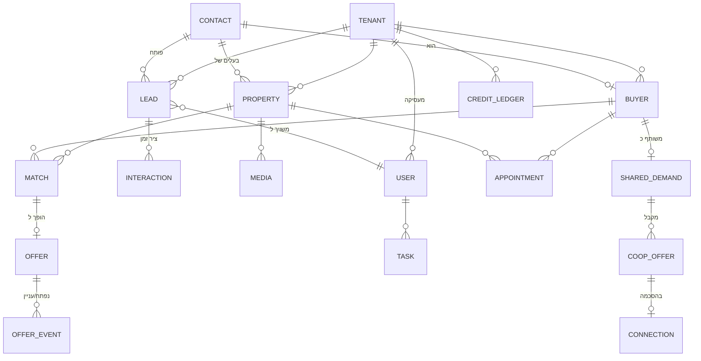

# 03 · מודל נתונים

## 1. עקרונות

1. **Multi-Tenant בבסיס נתונים משותף**: לכל טבלה עסקית עמודת `tenant_id` (הסוכנות). בידוד נאכף בשלוש שכבות — Global Scope באפליקציה, Policy בכל Endpoint, ו-**Row-Level Security ב-PostgreSQL** כקו הגנה אחרון (גם באג באפליקציה לא ידלוף דאטה בין סוכנויות). ראו [ADR-003](adr/ADR-003-multi-tenancy.md).
2. **מזהים**: ULID לכל הישויות (ממוין-זמן, לא חושף נפח פעילות, ידידותי לאינדקסים).
3. **שדות מובנים + JSONB**: מאפייני נכס/דרישות קונה הנפוצים = עמודות אמיתיות (ניתנות לאינדוקס והתאמה); מאפיינים נדירים/עתידיים = `attributes JSONB`. כך מוסיפים מאפיין בלי מיגרציה.
4. **Soft Delete + היסטוריה**: ישויות ליבה לא נמחקות פיזית; שינויים מהותיים נרשמים ב-Audit.
5. **PII מוצפן**: טלפון, אימייל ושם של לקוחות קצה מוצפנים ברמת עמודה (ראו מסמך 04); חיפוש לפי טלפון דרך עמודת hash.

## 2. תרשים ישויות מרכזי

## 3. ישויות עיקריות

### Identity & Tenancy
- **tenants** — סוכנות: **`customer_no`** (מספר הלקוח), שם, מסלול, סטטוס, הגדרות (JSONB: מיתוג, שעות פעילות, שפה), `kanko_enabled`, הגדרות שיתוף.
  - ‎**`customer_no` — מה שאפשר להקריא בטלפון.** ה-ULID מזהה שורה; הוא אינו נאמר, אינו מוקלד ואינו נזכר. המספר מחולק מרצף במסד (`tenant_customer_no_seq`, אותו דפוס של `support_reference_seq`) ומתחיל ב-**100000**: שש ספרות לפחות, כי מספר קצר („משרד 7”) נקרא כמונה פנימי ולא כזהות, ומספרים באורך משתנה אינם נסרקים בעין בטור אחד. הרצף ממשיך לשבע ספרות מעצמו — „לפחות שש”, לא „בדיוק שש”. עמודה ולא נגזרת מסדר כלשהו: מספר לקוח שמשתנה כשמשרד נמחק גרוע ממספר שאינו קיים. מוצג ברשימת המשרדים ב-`/platform` ובהגדרות המשרד עצמו, כדי שגם מי שנשאל „מה מספר הלקוח שלכם” יוכל לקרוא אותו.
- **users** — סוכן/מנהל: שייך ל-tenant, תפקיד, טלפון (לוואטסאפ פנימי), העדפות התראה, 2FA.
- **roles / permissions** — RBAC מבוסס Capabilities (ראו מסמך 04).

### CRM
- **contacts** — אדם אמיתי אחד (טלפון מנורמל = מפתח ייחודי לכל דייר): שם, טלפונים, אימייל, `phone_hash` לחיפוש. קונה, מוכר וליד מפנים לאותו contact — אין כפילויות אדם.
- **leads** — פנייה: מקור (voice/whatsapp/web/kanko/manual), כוונה (buy/sell/info), סטטוס (new/in_progress/waiting/converted/closed), `requires_human` + סיבה, שיוך לסוכן, SLA timestamps.
- **interactions** — ציר זמן אחוד: שיחה (עם קישור להקלטה+תמלול+סיכום), הודעת וואטסאפ, פגישה, הערה. `interaction_type`, `direction`, `payload JSONB`.

### נכסים
- **properties** — עיר, שכונה, רחוב, סוג (כולל תשעה ענפים מסחריים — חנות, משרד, מחסן, תעשייה, מרתף, בניין, מרלו"ג, חניה, תחנת דלק — לצד `commercial` שהוא „מסחרי שלא נאמר איזה”; בהתאמה המטרייה מכסה כל ענף **בשני הכיוונים**, אחרת פיצול הסוגים היה פוסל בשקט כל קונה קיים שסימן „מסחרי” — ראו `logic/commercial-types.ts`), חדרים, מ"ר, קומה/מתוך, מחיר + גמישות, תאריך כניסה, בלעדיות (+תוקף), סטטוס (draft/active/on_hold/sold/rented/archived), בוליאנים נפוצים (מעלית, חניה, ממ"ד, מרפסת, מחסן), מצב הנכס, `attributes JSONB`, `readiness_score` (0–100, מחושב), `marketing_title`, `marketing_description`, `owner_contact_id`, `agent_user_id`, הערות פנימיות.
  - `shared_tabu` — **רישום בטאבו משותף (מושאע)**, `BOOLEAN NOT NULL DEFAULT false`. ‎**מקור אמת אחד לעובדה שהיו לה שניים:** `shared_tabu` קיים גם כערך ב-`PropertyTypeSchema` מלפני העמודה, ומחלץ ההקלטה וייבוא ה-CSV עדיין מייצרים אותו. הדגל הוא הבית (הוא מרכיב עם כל סוג מבנה, בעוד שהסוג תופס את המשבצת היחידה ומוחק את „פנטהאוז”), והסוג הוא קלט שנכתב אליו — **מדליק ולעולם לא מכבה**, כדי ש-`PATCH` על הסוג לא ימחק סימון מפורש. ‎**וכיבוי מפורש פורש את הסוג הישן:** „לא בטאבו משותף” על שורה שהסוג שלה הוא הייצוג הישן פירושו שהייצוג שגוי, ולכן הסוג חוזר ל„לא ידוע” — אחרת התיבה חוזרת מסומנת אחרי כל שמירה ואין דרך לכבות אותה. אין בכך אובדן מידע: `shared_tabu` מעולם לא תיאר צורת מבנה. `isSharedTabuProperty()` היא התשובה היחידה בקוד, `sharedTabuWhere()` היא הצורה היחידה ב-SQL, והשתיים נבדקות זו מול זו על אותה טבלת מקרים. עובדה משפטית ולא מאפיין נוחות: אין חלקה נפרדת, כל מהלך דורש התייחסות לשותפים, והמימון מוגבל. הוא **מסונן בשרת** (`GET /properties?sharedTabu=true|false`, אינדקס חלקי על ה-`true`), והוא גם התנאי היחיד שפותח שידוך שותפים — ראו „שותפויות” למטה. `NOT NULL` ולא `NULL` בכוונה: זה סימון של המתווך, ומצב שלישי „טרם נבדק” הוא מצב שאיש אינו מתחזק.
  - ‎**ומי כבר נשאל — בעמודה נפרדת, לא במצב שלישי.** `shared_tabu_confirmed_at` (`NULL` = טרם נשאל) קיים מפני שהפער אמיתי: המנוע **פוסל** נכס משותף מקונה שסירב, ולכן נכס שרשום במשותף ולא סומן מוצע דווקא למי שאמר „לא”. `NULL` בדגל עצמו לא היה פותר — או שהוא נקרא כ„לא” ושום דבר לא משתנה, או שהוא חוסם וכל המאגר הקיים מפסיק להיות מוצע עד שמישהו יעבור עליו. לכן **הדגל, הסינון וההתאמות לא השתנו כלל**: העמודה היא תיעוד, לא שער. `GET /properties/shared-tabu-review` מחזיר את מה שטרם נבדק ואת המונה המלא, ו-`PATCH /properties/:id/shared-tabu` הוא **הדבר היחיד שכותב את החותמת** — שמירה רגילה של כרטיס הנכס אינה חותמת, כי טופס העריכה שולח את התיבה בכל שמירה וחותמת שאפשר לקבל בטעות אינה עדות. החריג היחיד הוא `createFromIntake`, שמקבל `sharedTabuAnswered` כפרמטר **חובה**: הבעלים עצמו נשאל בטופס המוכר, וזו תשובה לכל דבר. אינדקס חלקי על `shared_tabu_confirmed_at IS NULL` — הוא מתכווץ ככל שהמעבר מתקדם.
  - `agent_user_id` הוא **הסוכן המטפל בנכס** — התשובה ל„של מי זה?” בסוכנות עם כמה סוכנים. נכס חדש שייך למי שיצר אותו, בדיוק כמו `buyers.owner_user_id`. השדה **מתעד ואינו מסתיר**: הוא אינו משנה מי רואה מה, ונכסים נשארים גלויים לכל המשרד. `NULL` = נכס שקדם לעמודה או שנותק ממנה במפורש, והמסך אומר „לא משויך”.
- **property_media** — תמונות/מסמכים: S3 key, סוג, סדר, alt text.
- **recruitment_targets** — „נכסים לגיוס”: מודעה שהמשרד רודף אחריה ו**אינו מייצג** עדיין. שדות הנכס (עיר, רחוב, סוג, חדרים, מ"ר, קומה, מחיר), `source` + `source_url` (מאיפה הגיע והקישור למודעה המקורית — http/https בלבד, כי הוא מרונדר כ-`href`), `status` ממשפך הגיוס (`new`/`called`/`awaiting_reply`/`meeting_set`/`recruited`/`declined`/`lost` — ראו `logic/recruitment.ts`), שם וטלפון הבעלים כ**טקסט**, ו-`converted_property_id`. ייבוא מאקסל נכנס דרך `POST /import/recruitment` בלבד — הוא כותב לטבלה הזו ולעולם לא ל-`properties`, ולכן שורה מיובאת אינה מגיעה להתאמות, לרשת שיתופי הפעולה או להצעות עד ההמרה. טלפון בעלים או קישור שאינם תקינים יורדים מהשורה עם אזהרה במקום להפיל אותה — המודעה עצמה היא העיקר בשורת גיוס.
  - ‎**טבלה נפרדת ולא סטטוס על `properties`, וזו ההכרעה המרכזית.** הכלל „לא מציעים נכס כזה” היה נדרש בכל מסלול קריאה — התאמות, רשת שיתופי הפעולה, הצעות, דפי נחיתה, המונים — וזה בדיוק הדפוס שהוליד את הבאג של „נמכר”: נאכף בכתיבה, הונח בקריאה, ושורה שברחה הופיעה במסך לתמיד. כאן הדליפה חמורה יותר: הצעת נכס שהמשרד אינו מייצג היא הבטחה בלי כיסוי מול הקונה, וחשיפה מול בעלים שלא חתם. שורה בטבלה אחת אינה יכולה לדלוף לשאילתה על טבלה אחרת.
  - הבעלים נשמר כטקסט ולא כ-`contact`: איש קשר במערכת הוא לקוח של המשרד, ומי שטרם חתם אינו כזה. הוא נהיה איש קשר **ברגע ההמרה** בלבד.
  - ‎**הרשימה מסוננת בשרת** (`GET /recruitment`): שלב, מקור, עיר, טווח מחיר, טווח חדרים, טווח שטח וחיפוש חופשי — אותם עוזרים משותפים של רשימת הנכסים (`priceRangeAgorot`, `normalizeRange`, `freeTextTerms`), ולכן שני המסכים מסננים אותו דבר על אותה שאלה. החיפוש החופשי עובר על כתובת, שכונה, עיר, סוג נכס והערות — **ולא על שם הבעלים או הטלפון שלו**: הרשימה משרדית, וחיפוש לפי שם היה הופך אותה לכלי לאיתור אנשים על פני מה שכל סוכן במשרד רודף אחריו. סינון בצד הלקוח לא היה מספיק — התקרה היא 500 שורות, וייבוא אחד מביא יותר. `POST /recruitment/bulk-delete` מוחק מרוכז דרך אותה מחיקה בודדת (נעילה + ניקוי הפולואפים), ולכן אין מסלול שני שישכח את הניקוי.
  - ‎`converted_property_id` ייחודי בתוך הדייר, ונכתב רק בהמרה. זה מה שהופך המרה כפולה לבלתי אפשרית ברמת המסד: ההמרה תופסת את השורה בעדכון מותנה לפני שהיא יוצרת נכס, ולחיצה שנייה מקבלת את הנכס הקיים במקום ליצור שני.
- **voice_intakes** — הקלטת קליטה: קובץ, תמלול, שדות שחולצו, שדות חסרים, סטטוס עיבוד. נשמר לצורך שחזור ותיקון.
- **intake_requests** — הטופס שהלקוח ממלא בעצמו: טוקן (43 תווים, ייחודי גלובלית — הוא נפתר לפני שידוע הדייר), הכרטיס שאליו הוא מצביע, סטטוס, תפוגה, ומה שהלקוח שלח (`answers`). `side` הוא **לאיזה צד של העסקה הוא נענה** — `buyer` או `seller` — ונשמר על השורה ולא נגזר מהתשובות, כדי שלקוח שפותח את הקישור שוב כדי לתקן יחזור למסלול שבו כבר היה. `property_id` הוא טיוטת הנכס שהמוכר יצר, ובלעדיו שליחה חוזרת הייתה פותחת נכס שני לאותה דירה.

### קונים
- **buyers** — מקושר ל-contact: ערים/שכונות מבוקשות (מערך), תקציב מינ'-מקס', חדרים, סוגי נכס, **must_have / nice_to_have** (JSONB מובנה), `floorPreference` (קומה רצויה — **טווח או רשימה, ולעולם לא שניהם**: „משלוש ומעלה” ו„קרקע או ראשונה” הן שתי דרישות שונות בצורתן, ו-`union` מתויג מונע את השאלה „מה גובר” מלהיוולד), גמישות, מצב מימון, `maturity` (very_hot/hot/interested/not_ripe — מחושב + ניתן לדריסה ידנית), `office_status` (מזהה מתוך רשימת הסטטוסים של המשרד ב-`tenants.settings -> 'buyerStatuses'`; כל סטטוס נושא `maturity` שהוא נשען עליה, ולכן בחירה בו קובעת את שתיהן — ראו `packages/shared/logic/buyer-status.ts`), מקור, הערות AI, הערות מתווך.
  - `shared_tabu_stance` — **עמדת הקונה כלפי רישום משותף**: `accepts` · `refuses` · `NULL` = **טרם נשאל**. שלושה מצבים ולא שניים, וזה ההבדל שקובע: „הקונה אמר לא” סוגר את הנכס, „איש לא שאל” פותח שיחה. חוסר שנקרא כסירוב היה מסתיר נכסים בטאבו משותף מכל הקונים הקיימים ברגע אחד; חוסר שנקרא כהסכמה היה ממציא הסכמה משפטית בשם הלקוח. במנוע ההתאמות זהו **שער ולא קריטריון משוקלל** (`logic/shared-tabu.ts`) — משקל היה מאפשר למשרד לכייל אותו לאפס ולהחזיר בדיוק את ההצעה שהקונה סירב לה. העמודה **נגזרת מ-`requirements`** ונכתבת יחד איתו דרך `requirementColumns()`, כמו `has_search_areas`. ‎**והגזירה אינה „מה שנשלח בשדה”:** `shared_tabu` היה ערך ב-`propertyTypes` הרבה לפני העמודה, וקונה שביקש אותו כבר אמר „מקבל” — לכן `buyerSharedTabuStance()` מחזירה את השדה המפורש כשהוא קיים, ואחרת נגזרת מהדרישה הישנה. סירוב מפורש גובר תמיד: הוא אמירה של הלקוח, והדרישה הישנה היא מה שבא **במקום** אמירה ולא מעליה. אותה גזירה חלה בקריאה (`scoreMatch`, `partnerPairs`), בכתיבה (העמודה), ובהגירה שמילאה את השורות הקיימות — בלעדיה דווקא הקונים שכבר הצהירו על נכונות היו האחרונים לקבל שידוך שותפים.
  - ‎**שותפויות** (`logic/partner-match.ts`, `GET /matches/property/:id/partners`) — שני קונים על נכס אחד בטאבו משותף. שלושה תנאים: אף אחד מהם אינו מגיע לבד (בדיוק רצועת התקציב של המנוע, ולכן הרשימה **זרה** לרשימת ההתאמות), שניהם סימנו `accepts`, וכל אחד מהם עובר את המנוע בכל שאר הקריטריונים — נמדד בהרצה חוזרת של `scoreMatch` **בלי התקציב**, ולא בכלל חדש שיסתור אותו ביום שהרצועה תשתנה. הציון הוא החלש מבין השניים, והחלוקה יחסית לתקציבים כשהעיגול נופל על בעל התקציב הגדול. הסינון לפי בעלות נעשה **בשאילתה**: ההצעה כאן היא היכרות בין שני אנשים בשמם, ולכן סוכן רואה רק שותפויות בין הלקוחות שלו — מנהל בלבד רואה צמד שחוצה שני סוכנים.

### התאמות והצעות
- **matches** — `property_id` + `buyer_id` (ייחודי): `score` 0–100, `score_breakdown JSONB` (ניקוד לכל קריטריון — הבסיס להסבר), `explanation` (טקסט מוכן), סטטוס (suggested/dismissed/offered), `computed_at`. מתעדכן מחדש באירועי שינוי.
- **offers** — הצעה שנשלחה: match, ערוץ, נוסח שנשלח, `public_token` (לדף ההצעה), סטטוס (sent/delivered/opened/interested/declined/expired), מונה פתיחות.
- **offer_events** — כל פתיחה/קליק/תגובה עם timestamp (מזין את "פתח 3 פעמים — כדאי לחזור אליו").

### יומן ומשימות
- **appointments** — פגישה/סיור/שיחה: משתתפים, נכס, זמן, סטטוס, `google_event_id`, תוצאת פולו-אפ (אהב/לא מתאים/מו"מ/צריך אחר). תזכורת הסיור מסומנת ב-`reminder_sent_at` (NULL = טרם נשלחה); דחיית הפגישה מנקה אותה, כדי שהמועד החדש יקבל תזכורת משלו.
- **tasks** — משימה: סוג, יעד (polymorphic: ליד/נכס/קונה), עדיפות, due, מקור (ai_suggested/manual/automation).
- **reminders** — תזכורת מתוזמנת: יעד, ערוץ, זמן, סטטוס שליחה.

### שיתופי פעולה וקרדיטים
- **shared_demands** — ביקוש אנונימי: נגזר מ-buyer אך **מנותק ממנו פיזית** (טבלה נפרדת, ללא PII, עם `origin_buyer_ref` מוצפן שרק סוכנות המקור יכולה לפענח), טווחי תקציב מעוגלים, אזורים, דרישות. `visibility` (network/kanko/off).
- **coop_offers** — הצעת נכס לביקוש: סוכנות מציעה, נכס (בחשיפה מדורגת — בלי כתובת מדויקת עד אישור), סטטוס, עלות קרדיטים.
- **shared_leads** — הפניית לקוח: לקוח שאינו מתאים למשרד אחד מופנה למשרד שכן יכול לשרת אותו. בלוח מידע אנונימי בלבד (כוונה, מקור, עיר, **סיבת ההפניה** — חובה — והערה); פרטי הקשר הם צילום מוצפן שמועתק למשרד הקולט רק אחרי הקליטה. התמורה נקבעת בידי המשרד המפנה, ועמלת הפלטפורמה מצולמת לצדה ברגע הפרסום (`price_credits`, `platform_fee_credits`).
- **lead_referral_ratings** — דירוג הדדי על הפניה שנקלטה: ציון 1–5 והערה, שורה לכל צד. התמורה משולמת על ההפניה ולא על תוצאה ואין החזרים, ולכן הדירוג הוא המנגנון שמייקר הפניית זבל. RLS: שני הצדדים להפניה בלבד — אין קריאת רשת.
- **referral_reputation** — מוניטין ההפניות של משרד: סכום ומונה בלבד. טבלה נפרדת מהדירוגים כדי שהלוח יוכל להציג את הציון לכל הרשת מבלי לחשוף הערה שמשרד כתב על משרד.
- **connections** — חיבור שאושר ע"י שני הצדדים: תנאי שיתוף עמלה, ציר זמן, מסמכים.
- **credit_ledger** — ספר תנועות קרדיטים append-only: סוג פעולה, כמות, יתרה, הפניה לפעולה. אין עמודת "יתרה" שמתעדכנת — היתרה נגזרת (עם Snapshot ל-Cache).
- **kanko_leads** — לידים שנקלטו מ-Kanko: payload גולמי + מיפוי לליד/ביקוש, סטטוס עיבוד, `external_id` ייחודי (מניעת כפילויות).

### אימייל
- **email_domains** — הדומיין של המשרד לשליחה מכתובת שלו: דומיין, כתובת שולח, סטטוס אימות, הרשומות שיש להוסיף אצל ספק הדומיין, מועד הבדיקה האחרונה. שורה אחת לדייר, FORCE RLS. משרד בלי שורה שולח מכתובת הפלטפורמה.
- **email_messages** — התכתבות עם הלקוח בשני הכיוונים: כיוון, נושא, גוף (בתשובה נכנסת — התשובה החשופה בלבד), `provider_message_id` לדה-דופליקציה, מועד קריאה. FORCE RLS, מפתח לפי `(tenant_id, contact_id)`.
  `card_kind` + `card_id` — **על מה** ההודעה (`buyer` | `lead` | `property`), כשזה ידוע. החוט נשאר לפי אדם; זה תג על ההודעה הבודדת. `NULL` הוא הערך הנפוץ ולא חוסר: הוא נכתב רק כששליחה יצאה מכרטיס, וכשתשובה ירשה אותו מטוקן ה-Reply-To שלה. **אין גזירה בדיעבד** — „הקונה של הלקוח הזה” נכון לרוב הלקוחות ושגוי אצל מי שיש לו שניים, ותג שגוי שנראה סמכותי גרוע מהיעדר תג. בקריאה התג נבדק מול הכרטיס עצמו (חי, ובמסנן הבעלות), כדי שלא יגלה כרטיס של עמית ולא יוביל ל-404.
- **email_attachments** — קבצים מצורפים, נכנסים ויוצאים: סוג (image/video/file), שם מנוקה, גודל, `s3_key`. התוכן באחסון האובייקטים; המחיקה עוברת ב-`storage.cleanup_object` כמו כל קובץ אחר.
- **email_send_attempts** — זיכרון של שליחה: מפתח הזהות העסקית, מצב (`sending`/`sent`/`unknown`/`rejected`) ומזהה ההודעה אצל הספק. נכתב **לפני** הקריאה לספק ומסומן אחריה, והמפתח נוסע גם כ-`Metadata` על ההודעה — ולכן כישלון עמום (פסק זמן, ‎5xx) ניתן להכרעה בדיעבד מול חיפוש ההודעות היוצאות, במקום לבחור בין מייל כפול למייל שלא הגיע. **אין בו נמען, נושא או תוכן** — להכרעה די במפתח. מחוץ ל-RLS כמו `support_threads`: אותה טבלה משרתת גם שליחות שאין להן דייר (הרשמה, התחברות, פלטפורמה), ופוליסה הייתה חוסמת דווקא אותן. נשמר חודש.
- **webhook_hits** — יומן הפניות **הנכנסות שנדחו**, לשני הנתיבים הציבוריים: המרכזייה וטופס הלידים (`source`). קיים כי פנייה עם מפתח לא מוכר נדחתה ולא הותירה עקבה, ואז „לא התקבל אף אירוע” נראה זהה למרכזייה שמעולם לא פנתה — שני מצבים שדורשים פעולה הפוכה. **מחוץ ל-RLS במודע** (כמו `lead_webhooks`): השורות המעניינות ביותר הן דווקא אלה שלא הצלחנו לשייך למשרד, וטבלה תחת RLS הייתה מסתירה אותן.
  ‏אין בה PII: המפתח נשמר בקידומת בת שישה תווים, שמות שדות נשמרים בלי ערכים (ערך נשמר רק לשדות טכניים), ומספר הפונה נשמר כחתימת HMAC (אותה `contacts.phone_hash`) בתוספת ארבע ספרות אחרונות — די כדי לחפש ולזהות פונה חוזר, בלי שהיומן יהפוך למאגר מספרים גלוי של כל המשרדים. חלון של תשעים יום, תקרה כרשת ביטחון (הנתיב ציבורי), וריקון יזום מ-`/platform`.
  ‏„לא ממופה” נשאל מול רשימת השדות של **הנתיב שממנו הגיעה הפנייה**; רשימה אחת לשניהם הייתה מסמנת כל שדה של ליד כמידע שאנחנו מפספסים.
- **email_reply_tokens** — הטוקן שבכתובת ה-Reply-To, שממנו נגזרים הדייר, הלקוח, **הסוכן ששלח** את ההודעה שעליה עונים **והכרטיס שממנו נשלחה** (`card_kind` + `card_id`). שלושת הממדים נכנסים גם לחיפוש השימוש החוזר ולא רק לכתיבה: טוקן שהונפק להצעה ונמצא שוב לשליחת הסכם היה מחזיר תשובה עם התג של ההצעה. **מחוץ ל-RLS במודע** (דפוס `lead_webhooks`): הוא מה שמזהה את הדייר, לפני שיש הקשר דייר. אין בו PII, ומותרים כמה טוקנים לאותו לקוח כדי שכתובות ישנות ימשיכו לעבוד אחרי מיזוג כרטיסים.
  - ‎**`sent_by_user_id` הוא חלק מזהות הטוקן, לא תיעוד לצדו** — הוא נכנס גם לחיפוש וגם להנפקה. בלעדיו טוקן שסוכן ב׳ הנפיק שימש גם לשליחה של סוכן א׳, והשדה היה מתאר את השליחה הראשונה בלבד. `NULL` = שליחה אוטומטית (סבב ההצעות) או טוקן מלפני השדה; אין FK, ולכן סוכן שעזב הוא פשוט מזהה שאינו מועמד — והתור חוזר לסדרו.

### פלטפורמה
- **support_threads / support_messages / support_attachments** — תיבת התמיכה של הפלטפורמה: שרשור לכל פונה (עם `reply_token` שנשתל בכתובת התשובה), ההודעות בשני הכיוונים, והקבצים המצורפים. מחוץ ל-RLS **ובלי `tenant_id` חובה**: פנייה יכולה להגיע ממי שאינו לקוח כלל. שיוך למשרד נעשה לפי כתובת השולח כשהיא מוכרת, ומחיקת משרד מוחקת את השרשורים שלו (בהם יושבים כתובת ותוכן).
- **support_tickets / support_ticket_messages / support_ticket_attachments** — הפניות שנפתחו מכפתור „תמיכה” שבמערכת. **תחת RLS** (`tenant_isolation` + `support_desk`), בשונה משלוש הטבלאות שמעליהן: כאן הפונה הוא תמיד משתמש של משרד, והמשרד קורא את השיחה שלו — ומה שהמשרד קורא יושב מאחורי פוליסה במסד ולא מאחורי סינון באפליקציה. הפנייה נושאת את השם, המייל **והטלפון** מהפרופיל, את ההקשר הטכני וצילום המסך; השיחה יושבת ב-`support_ticket_messages` עם `send_state` לכל תשובה יוצאת. `support_tickets.reply` נשמר לתאימות ומסונכרן עם ההודעה האחרונה, אך אינו מקור האמת.
- **invoices** — חשבונית מס קבלה על תשלום שנגבה: מזהה התשלום (**ייחודי** — מה שהופך את ההפקה לאידמפוטנטית), הספק, סטטוס (`pending`/`issuing`/`issued`/`failed`), מספר המסמך והקישור אליו, הסכום ופירוקו לנטו ומע"מ עם השיעור שהיה נכון בזמנו, ומוני הניסיונות. מחוץ ל-RLS כמו `payments`, ונשמרת גם אחרי מחיקת המשרד — מסמך מס בחובת שמירה.
- **messages** — כל הודעה יוצאת/נכנסת: ערוץ, ספק, תבנית, סטטוס ספק (sent/delivered/read/failed), עלות, `provider_message_id`.
- **funnel_stages / funnel_enrollments / funnel_messages** — מנוע המסלולים: הדיוור שהפלטפורמה שולחת ללקוחותיה שלה. שני מסלולים רצים עליו — **משפך ההמרה** (חשבון ניסיון → לקוח משלם) ו**מסלול הגבייה** (חיוב שנכשל → כרטיס שעודכן).
  - ‎**`funnel_stages` היא טבלת פלטפורמה ואין בה `tenant_id`** — אלה ההגדרות שלנו על הדיוור שלנו, כמו `platform_settings`. השלבים והנוסחים **נערכים במסך ואינם קבועים בקוד**, וזו הדרישה שמכתיבה את המבנה: אילו הם היו בקוד, „תעשה את זה ניתן לעריכה” אחר כך היה כתיבה מחדש.
  - ‎**שני שעונים, וזו ההכרעה המרכזית.** `clock` הוא תכונה של השלב: `funnel` נספר מ-`funnel_enrollments.started_at` (היום 0 של המשרד עצמו), `trial` מתפוגת הניסיון בפועל, ו-`payment` מרגע שהחיוב נדחה. תוכן ההפעלה („הוסיפו נכס ראשון”) נכון בכל יום; הודעת מועד („נשארו יומיים”) תלויה בתאריך אמיתי. שעון אחד היה שולח „נשארו יומיים” שמונה ימים אחרי שהחשבון כבר ננעל — לא הודעה מאוחרת, **הודעה שקרית**.
  - ‎`started_at` הוא **רגע הכניסה למסלול ולא תאריך ההרשמה**. משרד שנרשם לפני חודש ונכנס היום מתחיל היום ביום 0 ומקבל את כל התוכן; „כניסה בנקודה” לפי ותק הייתה מדלגת עליו. הכניסה עצמה מדורגת במנות יומיות (`funnelEntryPlan`), אחרת כל המשרדים הקיימים היו מקבלים את ההודעה הראשונה באותו בוקר — גל שמספר וואטסאפ יחיד אינו שורד. הרשמה טרייה עוקפת את המכסה, אחרת היום 0 שלה היה מגיע בעוד שבוע.
  - ‎**תקרת פיגור לכל שעון בנפרד** (`FUNNEL_MAX_LAG_DAYS`): שבוע לתוכן, יומיים למועד, יום לגבייה. מספר אחד לכולם היה מכריח לבחור בין מחיקת תוכן שימושי לשליחת שקרים. זה גם המנגנון שמונע משלוש הודעות המועד לצאת למשרד שהניסיון שלו פג מזמן.
  - ‎`funnel_enrollments` — אינדקס חלקי על `(tenant_id, track) WHERE ended_at IS NULL` מתיר **רישום חי אחד לכל מסלול** ובכל זאת מאפשר גבייה שנכשלת שוב בעוד חצי שנה. `ended_reason` אומר למה יצא (`paid`/`completed`/`opted_out`/`resolved`), כי „לא פעיל” אינו תשובה.
  - ‎**„הניסיון נגמר” ו„חסר תאריך ניסיון” אינם אותו דבר, וזו ההבחנה שקובעת מתי רישום נסגר.** `trial_ends_at` ריק נראה זהה בשני המקרים: משרד שעבר למסלול חינמי או שקיבל תקופה בהענקה — שם הריק הוא **סופי** — ומשרד שהתאריך שלו אופס ממסך החיוב ויכול לחזור מאותו מסך. שלב של שעון הניסיון שאין לו עוגן נקרא „עדיין אפשרי” במקרה השני (אחרת רישום היה נסגר לתמיד על ערך שחזר כעבור רגע) ו„בלתי אפשרי” בראשון (אחרת כל משרד חינמי היה נשאר פתוח לנצח וכל סבב היה סורק אותו מחדש).
  - ‎**ולכן `tenants.trial_concluded_at` — הסיבה נשמרת ואינה נגזרת.** ניסיון להסיק את ההבדל מ-`status` ומ-`paid_until` נשבר בשני הכיוונים: „פתח ללא תפוגה” מוחק את התאריך ומשאיר את הסטטוס „ניסיון” (מצב זהה לאיפוס הזמני), ומנהל שמחזיר משרד חינמי לניסיון הופך „נגמר” לשקר. מי שמסיים את הניסיון רושם זאת, מי שמעניק ניסיון חדש מאפס את הרישום, ו-`trialAnchorConcluded` קוראת במקום לנחש.
  - ‎**ניסיון שהוחזר פותח מחדש את הרישום שנסגר, ולא פותח חדש.** `enrollDue` מוציא מהמועמדות כל מי שאי פעם היה לו רישום, ולכן בלי הפתיחה מחדש משרד שהוחזר לניסיון לא היה מקבל דבר. `started_at` נשאר כשהיה — הוא כבר קיבל את תוכן ההפעלה, ומה שחסר לו הוא שלבי הניסיון מול התאריך החדש. רק `completed` נפתח: `opted_out` היא בקשה מפורשת להפסיק.
  - ‎`funnel_messages` — שורה **לכל נמען ולכל ערוץ**, לא לכל הודעה: למשרד יש שני בעלים, אחד פתח והשני לא, ושורה אחת לשניהם הייתה מוחקת בדיוק את מה שהמסך אמור להראות. אינדקס ייחודי על `(enrollment_id, stage_key, user_id, channel)` הופך שליחה כפולה לבלתי אפשרית ברמת המסד. `opened_at` הוא **הערכה בלבד** (פיקסל ש-Apple ו-Gmail טוענים גם בלי קורא); `clicked_at` הוא המדד האמיתי.
  - שתי טבלאות הדיירים **תחת RLS** עם `tenant_isolation` + `funnel_admin`, אותה תבנית של `support_tickets`: הדגל נדלק אך ורק ב-`withFunnelAdmin`, כי „כמה נשלחו החודש” היא שאלה חוצת-דיירים שאין דרך לענות עליה משרד-משרד.
- **outbox_events** — אירועי דומיין ממתינים להפצה (דפוס Outbox).
- **audit_log** — append-only: מי (user+tenant), מה (action), על מה (entity), מתי, מאיפה (IP), diff שדות רגישים. ללא UPDATE/DELETE ברמת הרשאות DB.
- **usage_events** — מדידת צריכה: דקות שיחה, הודעות, קריאות AI — לחיוב ומכסות.

## 4. אינדוקס ושאילתות חמות

| שאילתה | אינדקס |
|--------|--------|
| דשבורד: לידים פתוחים לסוכן | `leads (tenant_id, assigned_to, status, created_at)` |
| נכסים בטאבו משותף | `properties (tenant_id) WHERE shared_tabu` — חלקי, כי הם מיעוט |
| מי אישר טאבו משותף | `buyers (tenant_id, shared_tabu_stance)` — חלקי, רק מי שנשאל |
| הנכסים של סוכן | `properties (tenant_id, agent_user_id)` |
| התאמות לנכס | `matches (tenant_id, property_id, score DESC) WHERE status='suggested'` |
| חיפוש לקוח לפי טלפון | `contacts (tenant_id, phone_hash)` UNIQUE |
| קונים לפי אזור+תקציב (מנוע התאמות) | `buyers (tenant_id, maturity)` + GIN על ערים; סינון תקציב בעמודות |
| ביקושים ברשת לפי אזור | `shared_demands (visibility, city, budget_max)` |
| הודעות לפי שיחה | `messages (tenant_id, contact_id, created_at)` |

- כל שאילתה עסקית מתחילה ב-`tenant_id` — הוא העמודה הראשונה בכל אינדקס מורכב.
- ללא `SELECT *` בקוד; שליפת עמודות נדרשות בלבד. מניעת N+1 עם Eager Loading מוצהר.

## 5. מחזור חיים ושימור נתונים (Retention)

| נתון | שימור | הערות |
|------|-------|-------|
| הקלטות שיחה | 12 חודשים (ניתן להגדרה פר-דייר) | ואז מחיקה; התמלול נשאר |
| תמלולים וסיכומים | כל חיי הליד | |
| לידים סגורים | ארכוב אחרי 24 חודשים | שליפה לפי דרישה |
| audit_log | 7 שנים | דרישת רגולציה/סכסוכים |
| usage_events | 24 חודשים מפורט, אגרגציה לנצח | |
| נתוני דייר שעזב | ייצוא מלא + מחיקה תוך 90 יום | התחייבות חוזית |
