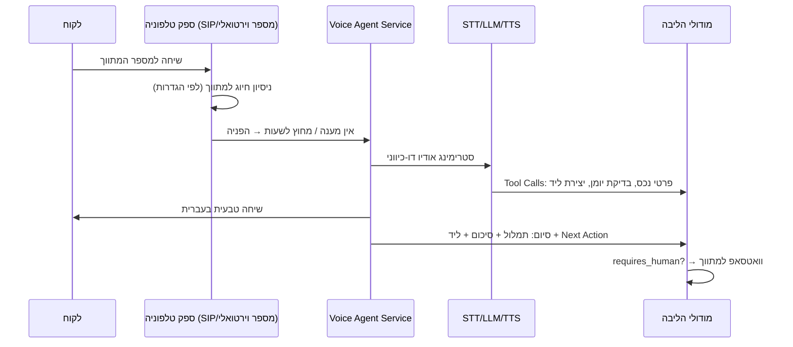

# 05 · אינטגרציות

## 0. עיקרון-על: שכבת הפשטה לכל ספק

כל ספק חיצוני יושב מאחורי Interface פנימי. הקוד העסקי לא מכיר שמות ספקים.

```
MessagingProvider  → WhatsAppCloudAdapter | TwilioAdapter | ...
TelephonyProvider  → SipProviderAdapter | TwilioVoiceAdapter | ...
SttProvider        → WhisperAdapter | GoogleSttAdapter | ...
LlmProvider        → AnthropicAdapter | OpenAiAdapter | ...
CalendarProvider   → GoogleCalendarAdapter | (Outlook בעתיד)
LeadSource         → KankoConnector | WebFormConnector | (יד2/מדלן בעתיד)
```

יתרונות: החלפת ספק בלי לגעת בליבה, ספק Fallback, בדיקות עם Fake Adapters, ומו"מ מסחרי חופשי.

## 1. WhatsApp — הערוץ המרכזי

**ספק מומלץ: WhatsApp Business Cloud API רשמי (Meta)**, ישירות או דרך BSP (Twilio/360dialog). לא ספריות לא-רשמיות — סיכון חסימה שהורג את המוצר. ראו [ADR-004](adr/ADR-004-whatsapp.md).

### שימושים
| כיוון | תרחיש | מצב |
|-------|-------|-----|
| יוצא ללקוח | הצעות נכסים, אישורי פגישה, תזכורות | 🟡 ההודעה נפתחת מוכנה אצל הסוכן; אין שליחה מהשרת |
| נכנס מלקוח | תגובות להצעות, "מעוניין", שאלות → מנותב לליד | ✅ |
| יוצא למתווך | התראות ("לקוח פתח הצעה"), סיכומי שיחה | ✅ בתוך המערכת ובפוש בדפדפן, לא בוואטסאפ |
| נכנס ממתווך | קליטת נכס בקול, אישור שליחה, עדכוני סטטוס | ⬜ |

### מה מומש בפועל

**נכנס — כן. יוצא — לא מהשרת.**

הקליטה עובדת: Webhook מאומת, ניתוב לדייר לפי המספר העסקי שקיבל את
ההודעה, ומניעת כפילויות לפי `message_id` של Meta. הודעה נכנסת הופכת
לליד או מצטרפת לכרטיס קיים.

השליחה **אינה** עוברת דרך ה-API של Meta. המערכת מנסחת את ההודעה
ופותחת אותה מוכנה בוואטסאפ של הסוכן, והוא לוחץ שלח. זו החלטה ולא
פער זמני: היא נותנת למתווך את הרגע האחרון לפני שהלקוח שלו מקבל
טקסט, והיא מוציאה את המערכת מכל שרשרת ההגבלות של Meta.

מכאן שכל מה שלהלן הוא **יעד ולא מצב**, וייכנס לתוקף רק ביום שתהיה
שליחה מהשרת:

- ⬜ **חלון 24 שעות** ותבניות מאושרות. אין Messaging Hub שמנהל אותו.
- ⬜ **ניהול תבניות** במערכת עם סטטוס אישור Meta, ו-fallback ל-SMS.
  אין טבלת תבניות ואין ערוץ SMS כלל.
- ⬜ **ניטור Quality Rating**, Opt-out ומכסות יומיות פר-דייר.
- ⬜ **קליטת נכס בהודעה קולית** בוואטסאפ. הקולט הנכנס מפרש `text`
  בלבד; קליטה בקול קיימת באפליקציה.
- ✅ **מספר עסקי לכל סוכנות**, מוגדר בהגדרות המשרד ומשמש לניתוב.
- ✅ **שליחה רק באישור מתווך** — כאן זה נאכף מעצמו: אין שליחה בלי
  לחיצה שלו.

### כללי עבודה (ליום שתהיה שליחה מהשרת)
- **חלון 24 שעות**: מענה חופשי רק בתוך חלון שיחה פעיל; מחוצה לו — תבניות (Templates) מאושרות בלבד.
- **תבניות**: מנוהלות במערכת עם סטטוס אישור Meta; עברית + משתנים; fallback ל-SMS אם תבנית נדחתה.
- **מספרים**: מספר עסקי לכל סוכנות (או לכל סוכן במסלול Agency).
- **איכות**: ניטור Quality Rating; Opt-out מיידי; מכסות יומיות פר-דייר.

## 2. טלפוניה וסוכן קולי

> **התרשים והכללים שבסעיף הזה הם תכנון.** הסוכן הקולי הטלפוני —
> ישות שעונה ללקוח בשיחה שלא נענתה — **לא נבנה**. מה שכן עובד מרוכז
> ב„מה מומש בפועל” שלמטה. „הסוכן הקולי” שבמוצר הוא דבר אחר לגמרי:
> הכתבה ופקודות קוליות של המתווך אל המערכת.

### ארכיטקטורת שיחה (תכנון)


- **ספק טלפוניה**: ספק מקומי עם SIP/API ומספרים ישראליים, עם אפשרות הקלטה והפניה מותנית. מאחורי `TelephonyProvider`.

### מה מומש בפועל

**קליטת שיחות — כל ספק.** המשרד מקבל כתובת Webhook אישית
(`integrations.webhook_key`), אותה תבנית של קליטת הלידים מהאתר. יש
**שני** נתיבים, `POST` ו-`GET`: הרבה מרכזיות בישראל יודעות רק "לקרוא
ל-URL" עם פרמטרים ב-query string, ובלי נתיב ה-GET חלק גדול מהמשרדים
לא היו יכולים להתחבר. `parseTelephonyEvent` מחפש כל שדה בשמות
המקובלים במקום להתאים את עצמו לספק אחד.

**חיוג יוצא — 015 בלבד.** מול
`https://www.015pbx.net/local/api/json/calls/make/` (GET, אימות
ב-`auth_username`/`auth_password`). השיחה **דו-שלבית**: 015 מצלצל
ל-`snumber` — הטלפון של הסוכן מהפרופיל שלו — וכשהוא עונה מחייג
ל-`cnumber`, הלקוח. `wait` נשלח תמיד, אחרת התשובה היא 204 בלי
`callid` ואין מזהה לקשור אליו את אירועי ה-Webhook. קוד 204 הוא
**הצלחה**: השיחה כבר מצלצלת.

**החייגן אינו מקבל מספר.** הנתיב מקבל `contactId`, והמספר נפתר בשרת
מהכרטיס אחרי `assertContactAccess`. נתיב שמקבל מספר חופשי הוא חייגן
פתוח על חשבון המשרד — מי שמשיג Session של סוכן זוטר מחייג למספרי
פרימיום בחו"ל, והחשבון מגיע ללקוח שלנו. `phone` מותר רק לבחירה בין
המספרים של אותו איש קשר, ונבדק מולם.

**השיחה אינה נרשמת בזמן החיוג** — היא תירשם כשהמרכזייה תדווח שהסתיימה,
דרך אותו Webhook של כל שיחה אחרת. רישום בחיוג היה מייצר שורה כפולה,
ושורה על שיחה שהסוכן לא ענה לה.

**הקטלוג מונה שני ספקים בלבד** — גנרי ו-015 — ושניהם ממומשים.
Zadarma ו-Voicenter היו שם בלבד: אף שורת קוד לא קראה את הטוקן או את
מפתח ה-API שלהם, וקליטת השיחות ממילא אינה תלוית ספק. מי שבחר בהם
קיבל בדיוק את הגנרי, אחרי שמסר אישורי גישה שנשמרו מוצפנים ולא שימשו
לדבר. ספק נכנס לקטלוג כשיש לו קוד, לא כשיש לו שם.

`clickToDial` מציין **קיום מימוש** ולא תמיכה של הספק.
- **מנוע השיחה**: שתי אופציות — פלטפורמת Voice-AI מנוהלת (Vapi/Retell — מהיר לשוק) או הרכבה עצמית (STT streaming + LLM + TTS). **המלצה: מנוהלת בשלב 2, עם הפשטה שמאפשרת מעבר לעצמית כשהנפח מצדיק.** ראו [ADR-005](adr/ADR-005-voice-agent.md).
- **עברית**: תנאי סף לבחירת ספק — STT/TTS עברית ברמה גבוהה; בדיקת POC לפני התחייבות.

### כללי התנהגות הסוכן הקולי (תכנון — טרם נבנה)
- מציג את עצמו בשם המשרד; מודיע על הקלטה.
- עונה רק מתוך נתוני הנכסים של הדייר (Tool מוגבל); לא ממציא ולא מבטיח.
- **אסקלציה לאדם**: לקוח עצבני / שאלה משפטית / מו"מ / בקשה מפורשת / חוסר הבנה כפול / עסקה רגישה → סיום מנומס + סימון `requires_human` + וואטסאפ מיידי למתווך.
- שעות פעילות, קול, ונוסחי פתיחה — ניתנים להגדרה פר-דייר.

## 3. AI Services (STT / LLM)

- **שימושים**: תמלול (שיחות + הודעות קוליות), חילוץ שדות נכס/קונה (Structured Output עם JSON Schema), תיאור שיווקי, סיכום שיחה, דירוג בשלות, הסברי התאמה, המלצות Next Best Action.
- **Prompt Registry**: כל פרומפט מנוהל בקוד עם גרסה; שינוי פרומפט = PR, לא עריכה חיה. A/B על גרסאות.
- **הערכת איכות**: סט בדיקות קבוע (הקלטות מדגם בעברית עם תוצאה צפויה) שרץ על כל שינוי פרומפט/ספק.
- **עלויות**: כל קריאה נמדדת (טוקנים, עלות, דייר) → `usage_events`; תקרות פר-דייר; מודלים זולים למשימות פשוטות, חזקים לחילוץ ולסוכן הקולי.
- **פרטיות**: הסכמי אי-אימון (No-Training) עם ספקי ה-AI; מיסוך PII היכן שאפשר.

## 3.5 אימייל — Postmark

**ספק: [Postmark](https://postmarkapp.com)** (טרנזקציוני; שיעור מסירה גבוה, לוגים נוחים). מאחורי `EmailService` — החלפת ספק נוגעת בקובץ אחד.

### שימושים
| תרחיש | סטטוס |
|-------|-------|
| איפוס סיסמה ("שכחתי סיסמה") | פעיל |
| קוד אימות כניסה (OTP) | פעיל כש-`LOGIN_OTP_ENABLED=true` |
| התראות למתווך, הצעות במייל | עתידי |

### הגדרה
1. Postmark ⟵ Servers ⟵ השרת ⟵ **API Tokens** ⟵ העתקת ה-Server Token.
2. **Sender Signatures**: אימות כתובת השולח (או אימות הדומיין כולו — עדיף: מוסיף DKIM ו-Return-Path ומשפר מסירה).
3. ב-`.env.production`: `POSTMARK_SERVER_TOKEN` ו-`EMAIL_FROM`, ואז `up -d api`.

### כללי עבודה
- **הגנת נעילה**: אימות הכניסה בקוד נכנס לתוקף רק כששני התנאים מתקיימים — הדגל דלוק *וגם* ספק מוגדר. דגל דלוק בלי ספק מדולג עם אזהרה ללוג, כדי שלא ייווצר מצב שבו נשלחים קודים לשומקום ואף אחד לא יכול להיכנס.
- **בלי דליפת קיום חשבון**: "שכחתי סיסמה" מחזיר תמיד את אותה תשובה, גם לכתובת שאינה רשומה.
- **טוקנים**: קישור האיפוס נשמר כ-SHA-256 ב-Redis בלבד, תקף 30 דקות, שימוש יחיד (GETDEL אטומי), ומבטל את כל ה-sessions של המשתמש אחרי איפוס.

## 4. Kanko — מקור לידים חיצוני

נקודת המגע היחידה: **קבלת לידים/ביקושים מ-Kanko** לטובת שיתופי פעולה. אין תלות ליבה.

- **מנגנון**: Webhook נכנס חתום (HMAC + timestamp) או Pull API מתוזמן — לפי מה ש-Kanko תומך. `KankoConnector` ממפה payload → `kanko_leads` → ליד/ביקוש במערכת.
- **דה-דופליקציה**: `external_id` ייחודי; ליד קיים מתעדכן, לא משוכפל.
- **קרדיטים**: אם הצעה לליד Kanko עולה קרדיטים — התנועה נרשמת ב-`credit_ledger` עם הפניה.
- **ניתוק חינני**: Kanko נופל/משתנה — שום דבר אחר במערכת לא מושפע; הלידים פשוט מפסיקים להגיע ומתריעים לתפעול.

## 5. Google Calendar — **מומש**

- OAuth 2.0 **פר-משתמש** ולא פר-משרד. ליומן יש בעלים אחד; חיבור ברמת
  המשרד היה מחייב חשבון Google משותף, מה שאף משרד לא עושה. הטבלה
  `google_calendar_links` נושאת `user_id` ייחודי.
- Scopes מינימליים: `calendar.events` בלבד — קריאה וכתיבה של אירועים.
  **לא** `calendar` המלא, שנותן גם למחוק יומנים ולשנות שיתופים.
- `access_type=offline` + `prompt=consent`. בלי `prompt=consent`
  משתמש שאישר בעבר מקבל רק access token של שעה, והחיבור מת אחרי
  שעה — תקלה שנראית כמו "עבד ואז הפסיק".
- **סנכרון דו-כיווני בסורק אחד**, כל רבע שעה: קודם מושכים מ-Google
  ואז דוחפים החוצה. `appointments.sync_source` מבדיל בין פגישה
  שנקבעה כאן לבין אירוע שנמשך מהיומן; בלעדיו הדחיפה הייתה מחזירה
  ל-Google את מה שזה עתה הגיע ממנו — לולאה שבה כל צד "מעדכן" את
  השני לנצח.
- **משיכה מצטברת** (`syncToken`). Google מחזיר טוקן בסוף כל רשימה
  והבקשה הבאה מקבלת רק את מה שהשתנה; משיכה מלאה בכל סבב הייתה
  נחסמת תוך יום. תשובת 410 אינה שגיאה אלא הוראה — מתחילים בלי טוקן.
- **אירוע יום שלם מדולג.** "חופשה" ו"יום הולדת" הם רוב האירועים
  ביומן פרטי; משיכתם הייתה מציפה את היומן של המשרד ומדליפה פרטים
  אישיים לתוך מערכת של מקום העבודה.
- פגישה שמקורה במערכת אינה נדרסת מ-Google: מתעדכן הזמן בלבד, כי
  הקישור לנכס, לקונה ולתוצאת הסיור אין לו מקבילה ביומן.
- טוקנים מוצפנים באותו מנגנון של אישורי הסליקה; ניתוק מוחק את השורה
  מיידית. `last_error` מוצג במסך — חיבור שנשבר בשקט הוא חיבור
  שסומכים עליו ואינו עובד.
- **טרם מומש:** Push Notifications של Google (הסורק מכסה), ובדיקת
  זמינות לפני הצעת מועדים בסוכן הקולי.

## 6. תשלומים ומנויים — קארדקום

הספק שנבחר הוא **קארדקום**, ישראלי, עם דף תשלום מתארח וטוקניזציה.

**איך זה עובד:** המשרד בוחר מסלול ומחזור חיוב במסך `/settings/billing`;
השרת פותח עסקת LowProfile אצל קארדקום ומחזיר כתובת; הדפדפן מופנה
לדף **של קארדקום**, ושם מוקלד מספר הכרטיס. פרטי האשראי אינם עוברים
דרך המערכת בשום שלב — לא בזיכרון, לא בלוג ולא בגיבוי. מה שחוזר
אלינו הוא טוקן לחיוב חוזר, ארבע ספרות אחרונות ותוקף.

**הוובהוק אינו מקור אמת.** קארדקום אינו חותם את ההודעה שהוא שולח,
ולכן כל מי שיודע את הכתובת יכול לשלוח "שולם". מההודעה נלקח שדה אחד
בלבד — `LowProfileId` — וגם הוא רק כדי לשאול את קארדקום מה באמת קרה
(`GetLpResult`). **ההתאמה לשורה שלנו נעשית לפי `LowProfileId` ולא לפי
`ReturnValue`** — אזהרה מפורשת של קארדקום; ה-`ReturnValue` משמש
לצילוב בלבד. ההכרעה תמיד מהתשובה שאנחנו משכנו, ולעולם לא מגוף
ההודעה. בלי ההפרדה הזו כל אחד היה מפעיל לעצמו מנוי בבקשת POST אחת.

**אידמפוטנטיות.** קארדקום שולח את ההודעה יותר מפעם אחת, ובנוסף דף
החזרה של המשרד מבצע את אותו אימות בעצמו (כדי שמי ששילם לא ימתין
לוובהוק). שני המסלולים מגיעים לאותה פונקציה, והמעבר `pending ⟵ paid`
נעשה ב-`updateMany` מותנה — רק מי שהצליח לשנות את השורה מאריך את
התקופה. בלי זה תשלום אחד היה נותן חודשיים.

**הגדרה:** `/platform` ⟵ הגדרות ⟵ סליקה. שלושה שדות (מספר מסוף, שם
משתמש API, סיסמת API) ששמורים מוצפנים ב-`platform_settings`, עם נפילה
למשתני הסביבה `CARDCOM_*`. כתובת ה-Webhook להזנה בקארדקום מוצגת שם.
בלי שלושתם הסליקה כבויה ומסך המנוי מציג "התשלום המקוון טרם הופעל"
במקום כפתור שנופל.

**שער התפוגה יושב על שורת הדייר.** `tenants.paid_until` נכתב יחד עם
התשלום ונבדק ב-`tenantCanOperate` בכל אימות Session — אותו מבנה בדיוק
כמו `trial_ends_at`. זה מכוון: תפוגה שנשענת על סורק שירוץ אי-פעם
הייתה נותנת גישה חינם לכל מי ששילם פעם אחת. הסורק ב-workers
(`subscription-expiry`, כל שעה) מיישר את מצב המנוי לתצוגה בלבד, ואינו
שער אבטחה.

**יום החיוב נשמר כעוגן** (`subscriptions.billing_anchor_day`). מנוי
שנפתח ב-31 בינואר נגמר ב-28 בפברואר — ובלי עוגן, החישוב הבא היה יוצא
מ-28 ומגיע ל-28 במרץ במקום ל-31. הקיצור החד-פעמי היה הופך לקבוע.

**חידוש אוטומטי — בלי דף תשלום ובלי וובהוק.**
`Transactions/Transaction` עם הטוקן השמור מחזיר תשובה **סינכרונית**
שאומרת מיד אם החיוב עבר. לכן החידוש הוא סורק ותו לא (`RenewalService`
ב-API, כל שעה): הוא תופס את החידוש בעדכון מותנה על `current_period_end`
**לפני** הפנייה לקארדקום — כך ששני עותקי API לא יחייבו פעמיים — שולח
את החיוב, ובכישלון מחזיר את התקופה לקדמותה. בלי ההחזרה חיוב שנדחה היה
מזכה בחודש חינם.

חיוב שנכשל אינו נועל את המשרד מיד: `paid_until` נושא חלון חסד של
שלושה ימים, ונשלח מייל באותו רגע — מי שכרטיסו פג צריך את הימים כדי
לעדכן, לא הודעה ביום שבו הוא כבר בחוץ.

`CardExpirationMMYY` הוא ארבע ספרות מרופדות באפסים; לכן התוקף נשמר
כשני שדות מספריים ולא כמחרוזת אחת שצריך לפצל בכל חיוב.

**חשבוניות אינן מופקות בקארדקום.** כל בקשה נושאת אובייקט `Document`
עם `DocumentTypeToCreate: "Auto"`, אבל `"Auto"` פירושו **"לפי הגדרות
המסוף"** ולא "הפק חשבונית". המסוף שלנו אינו מוגדר להפקת מסמכים —
החשבוניות מופקות במערכת אחרת — ולכן לא נוצר מסמך ו-`DocumentInfo`
חוזר ריק. זה תקין ומכוון.

הבלוק נשאר בכל זאת: הוא נושא את פרטי הלקוח לתצוגת העסקה בממשק של
קארדקום, והיום שבו יוחלט להפיק שם חשבוניות דורש הדלקה במסוף בלבד.
`UnitCost × Quantity` חייב להסתכם בדיוק ב-`Amount` גם כשאין מסמך,
אחרת הבקשה נדחית.

**הצעות מנוי בלינק** (`subscription_offers`). מנהל הפלטפורמה תופר
במסך `/platform` הצעה — מסלול בסיס, תוספות (מספרי טלפון וכד'),
תכונות מעבר למסלול ומחיר סופי — ושולח ללקוח לינק ייחודי
(`/subscribe/<token>`); או יוצר לינק מכירה לחבילה קיימת שכל משרד
מחובר יכול לממש אחרי שיחת מכירה. הלינק פותח את אותו דף קארדקום
בדיוק, והסכום מחושב תמיד בשרת. בתשלום שמצליח — באותה טרנזקציה
שתופסת את השורה — המסלול מופעל, המחיר הסופי נכתב כמחיר המוסכם של
המשרד (`price_override_*`, כך שהחידוש האוטומטי גובה אותו), התכונות
שהובטחו נפתחות (`feature_grants`) והמימוש נספר. הצעה אישית נעולה
למשרד שלה וחד-פעמית; לינק שאינו תקף מוסבר בדף עצמו, ולינק של משרד
אחר נראה כלינק שאינו קיים.

**מה עדיין לא קיים:** חיבור החשבוניות למערכת שבה הן מופקות בפועל;
זיכוי מהממשק (`Documents/CancelDoc` דורש מספר מסמך, שאינו קיים כל
עוד המסוף אינו מפיק); ותזכורת לפני חידוש.

## 7. Webhooks יוצאים + API ציבורי (שלב 4)

- לדיירי Enterprise ולאתר השיווקי: מנוי על אירועים (`property.published`, `lead.created`...) עם חתימה, Retry, ו-Dead Letter.
- API ציבורי v1 מתועד (OpenAPI) עם API Keys scoped — זה שער ההרחבה לכל אינטגרציה עתידית שלא חזינו.

## 8. טבלת סיכום ספקים

| תחום | ראשי (מומלץ) | Fallback | הערות |
|------|--------------|----------|-------|
| WhatsApp | Cloud API רשמי | BSP שני | חובה רשמי |
| טלפוניה | ספק SIP ישראלי | — | POC עברית לפני בחירה |
| Voice AI | פלטפורמה מנוהלת | הרכבה עצמית | החלטה בשלב 2 |
| STT | Whisper/ספק עברית מוביל | ספק שני | Benchmark עברית |
| LLM | Claude (Anthropic) | ספק שני | Structured Outputs + עברית |
| Calendar | Google | Outlook (עתידי) | |
| סליקה | קארדקום | — | דף מתארח + טוקניזציה; פרטי כרטיס לא עוברים אצלנו |
