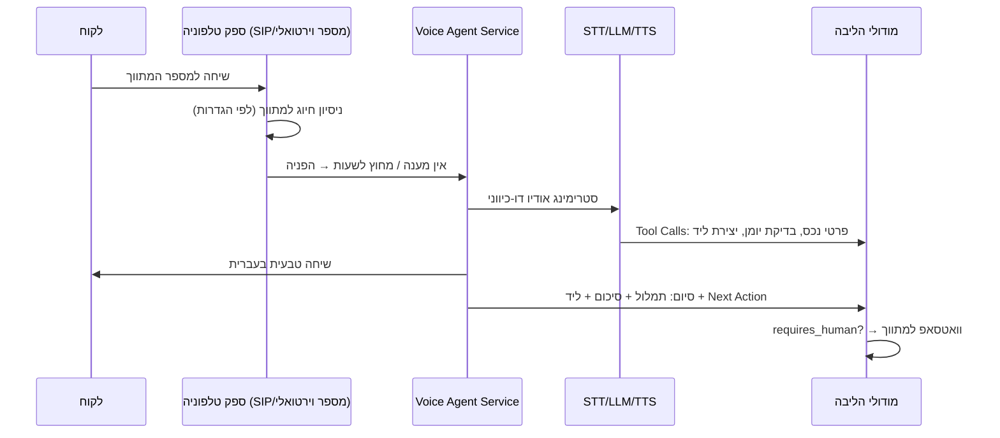

# 05 · אינטגרציות

## 0. עיקרון-על: שכבת הפשטה לכל ספק

כל ספק חיצוני יושב מאחורי Interface פנימי. הקוד העסקי לא מכיר שמות ספקים.

```
MessagingProvider  → WhatsAppCloudAdapter | TwilioAdapter | ...
TelephonyProvider  → SipProviderAdapter | TwilioVoiceAdapter | ...
SttProvider        → WhisperAdapter | GoogleSttAdapter | ...
LlmProvider        → AnthropicAdapter | OpenAiAdapter | ...
CalendarProvider   → GoogleCalendarAdapter | (Outlook בעתיד)
LeadSource         → KankoConnector | WebFormConnector | (יד2/מדלן בעתיד)
```

יתרונות: החלפת ספק בלי לגעת בליבה, ספק Fallback, בדיקות עם Fake Adapters, ומו"מ מסחרי חופשי.

## 1. WhatsApp — הערוץ המרכזי

**ספק מומלץ: WhatsApp Business Cloud API רשמי (Meta)**, ישירות או דרך BSP (Twilio/360dialog). לא ספריות לא-רשמיות — סיכון חסימה שהורג את המוצר. ראו [ADR-004](adr/ADR-004-whatsapp.md).

### שימושים
| כיוון | תרחיש |
|-------|-------|
| יוצא ללקוח | הצעות נכסים (תבנית מאושרת), אישורי פגישה, תזכורות |
| נכנס מלקוח | תגובות להצעות, "מעוניין", שאלות → מנותב לליד |
| יוצא למתווך | התראות ("לקוח פתח הצעה"), סיכומי שיחה, בקשות אישור |
| נכנס ממתווך | **קליטת נכס בקול**, אישור שליחה ("שלח"/"ערוך"), עדכוני סטטוס |

### כללי עבודה
- **חלון 24 שעות**: מענה חופשי רק בתוך חלון שיחה פעיל; מחוצה לו — תבניות (Templates) מאושרות בלבד. מנוהל אוטומטית ב-Messaging Hub.
- **תבניות**: מנוהלות במערכת עם סטטוס אישור Meta; עברית + משתנים; fallback ל-SMS אם תבנית נדחתה.
- **מספרים**: מספר עסקי לכל סוכנות (או לכל סוכן במסלול Agency). ניהול Onboarding של מספרים כחלק מהקמת דייר.
- **איכות**: ניטור Quality Rating; שליחה רק באישור מתווך; Opt-out מיידי; מכסות יומיות פר-דייר.
- **Webhook נכנס**: מאומת חתימה, נכנס לתור, Idempotent (הודעות כפולות של Meta מסוננות לפי `message_id`).

## 2. טלפוניה וסוכן קולי

### ארכיטקטורת שיחה


- **ספק טלפוניה**: ספק מקומי עם SIP/API ומספרים ישראליים (למשל Voicenter או שקול), עם אפשרות הקלטה והפניה מותנית. מאחורי `TelephonyProvider`.
- **מנוע השיחה**: שתי אופציות — פלטפורמת Voice-AI מנוהלת (Vapi/Retell — מהיר לשוק) או הרכבה עצמית (STT streaming + LLM + TTS). **המלצה: מנוהלת בשלב 2, עם הפשטה שמאפשרת מעבר לעצמית כשהנפח מצדיק.** ראו [ADR-005](adr/ADR-005-voice-agent.md).
- **עברית**: תנאי סף לבחירת ספק — STT/TTS עברית ברמה גבוהה; בדיקת POC לפני התחייבות.

### כללי התנהגות הסוכן הקולי
- מציג את עצמו בשם המשרד; מודיע על הקלטה.
- עונה רק מתוך נתוני הנכסים של הדייר (Tool מוגבל); לא ממציא ולא מבטיח.
- **אסקלציה לאדם**: לקוח עצבני / שאלה משפטית / מו"מ / בקשה מפורשת / חוסר הבנה כפול / עסקה רגישה → סיום מנומס + סימון `requires_human` + וואטסאפ מיידי למתווך.
- שעות פעילות, קול, ונוסחי פתיחה — ניתנים להגדרה פר-דייר.

## 3. AI Services (STT / LLM)

- **שימושים**: תמלול (שיחות + הודעות קוליות), חילוץ שדות נכס/קונה (Structured Output עם JSON Schema), תיאור שיווקי, סיכום שיחה, דירוג בשלות, הסברי התאמה, המלצות Next Best Action.
- **Prompt Registry**: כל פרומפט מנוהל בקוד עם גרסה; שינוי פרומפט = PR, לא עריכה חיה. A/B על גרסאות.
- **הערכת איכות**: סט בדיקות קבוע (הקלטות מדגם בעברית עם תוצאה צפויה) שרץ על כל שינוי פרומפט/ספק.
- **עלויות**: כל קריאה נמדדת (טוקנים, עלות, דייר) → `usage_events`; תקרות פר-דייר; מודלים זולים למשימות פשוטות, חזקים לחילוץ ולסוכן הקולי.
- **פרטיות**: הסכמי אי-אימון (No-Training) עם ספקי ה-AI; מיסוך PII היכן שאפשר.

## 3.5 אימייל — Postmark

**ספק: [Postmark](https://postmarkapp.com)** (טרנזקציוני; שיעור מסירה גבוה, לוגים נוחים). מאחורי `EmailService` — החלפת ספק נוגעת בקובץ אחד.

### שימושים
| תרחיש | סטטוס |
|-------|-------|
| איפוס סיסמה ("שכחתי סיסמה") | פעיל |
| קוד אימות כניסה (OTP) | פעיל כש-`LOGIN_OTP_ENABLED=true` |
| התראות למתווך, הצעות במייל | עתידי |

### הגדרה
1. Postmark ⟵ Servers ⟵ השרת ⟵ **API Tokens** ⟵ העתקת ה-Server Token.
2. **Sender Signatures**: אימות כתובת השולח (או אימות הדומיין כולו — עדיף: מוסיף DKIM ו-Return-Path ומשפר מסירה).
3. ב-`.env.production`: `POSTMARK_SERVER_TOKEN` ו-`EMAIL_FROM`, ואז `up -d api`.

### כללי עבודה
- **הגנת נעילה**: אימות הכניסה בקוד נכנס לתוקף רק כששני התנאים מתקיימים — הדגל דלוק *וגם* ספק מוגדר. דגל דלוק בלי ספק מדולג עם אזהרה ללוג, כדי שלא ייווצר מצב שבו נשלחים קודים לשומקום ואף אחד לא יכול להיכנס.
- **בלי דליפת קיום חשבון**: "שכחתי סיסמה" מחזיר תמיד את אותה תשובה, גם לכתובת שאינה רשומה.
- **טוקנים**: קישור האיפוס נשמר כ-SHA-256 ב-Redis בלבד, תקף 30 דקות, שימוש יחיד (GETDEL אטומי), ומבטל את כל ה-sessions של המשתמש אחרי איפוס.

## 4. Kanko — מקור לידים חיצוני

נקודת המגע היחידה: **קבלת לידים/ביקושים מ-Kanko** לטובת שיתופי פעולה. אין תלות ליבה.

- **מנגנון**: Webhook נכנס חתום (HMAC + timestamp) או Pull API מתוזמן — לפי מה ש-Kanko תומך. `KankoConnector` ממפה payload → `kanko_leads` → ליד/ביקוש במערכת.
- **דה-דופליקציה**: `external_id` ייחודי; ליד קיים מתעדכן, לא משוכפל.
- **קרדיטים**: אם הצעה לליד Kanko עולה קרדיטים — התנועה נרשמת ב-`credit_ledger` עם הפניה.
- **ניתוק חינני**: Kanko נופל/משתנה — שום דבר אחר במערכת לא מושפע; הלידים פשוט מפסיקים להגיע ומתריעים לתפעול.

## 5. Google Calendar

- OAuth 2.0 פר-משתמש (לא חשבון שירות); Scopes מינימליים (`calendar.events`).
- סנכרון דו-כיווני: פגישה במערכת → אירוע ביומן; שינוי/מחיקה ביומן → עדכון במערכת (Push Notifications של Google + סנכרון תקופתי כגיבוי).
- בדיקת זמינות לפני הצעת מועדים (הסוכן הקולי מציע רק חלונות פנויים).
- טוקנים מוצפנים; ניתוק חשבון מוחק טוקנים מיידית.

## 6. תשלומים ומנויים

- ספק סליקה עם תמיכה ישראלית מלאה + הוראות קבע (Stripe אם מתאים לישות העסקית, אחרת Grow/Tranzila/PayPlus) מאחורי `PaymentProvider`.
- Billing פנימי מנהל: מסלולים, מכסות, קרדיטים, חשבוניות (אינטגרציה לחשבונית ירוקה/iCount).
- אין שמירת פרטי אשראי אצלנו — טוקניזציה אצל הסולק בלבד (מוריד את רוב עול ה-PCI).

## 7. Webhooks יוצאים + API ציבורי (שלב 4)

- לדיירי Enterprise ולאתר השיווקי: מנוי על אירועים (`property.published`, `lead.created`...) עם חתימה, Retry, ו-Dead Letter.
- API ציבורי v1 מתועד (OpenAPI) עם API Keys scoped — זה שער ההרחבה לכל אינטגרציה עתידית שלא חזינו.

## 8. טבלת סיכום ספקים

| תחום | ראשי (מומלץ) | Fallback | הערות |
|------|--------------|----------|-------|
| WhatsApp | Cloud API רשמי | BSP שני | חובה רשמי |
| טלפוניה | ספק SIP ישראלי | — | POC עברית לפני בחירה |
| Voice AI | פלטפורמה מנוהלת | הרכבה עצמית | החלטה בשלב 2 |
| STT | Whisper/ספק עברית מוביל | ספק שני | Benchmark עברית |
| LLM | Claude (Anthropic) | ספק שני | Structured Outputs + עברית |
| Calendar | Google | Outlook (עתידי) | |
| סליקה | לפי ישות עסקית | — | טוקניזציה בלבד |
