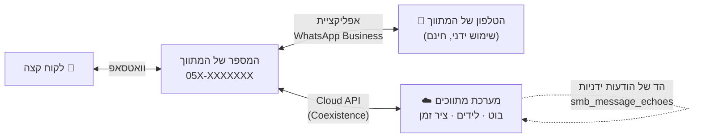
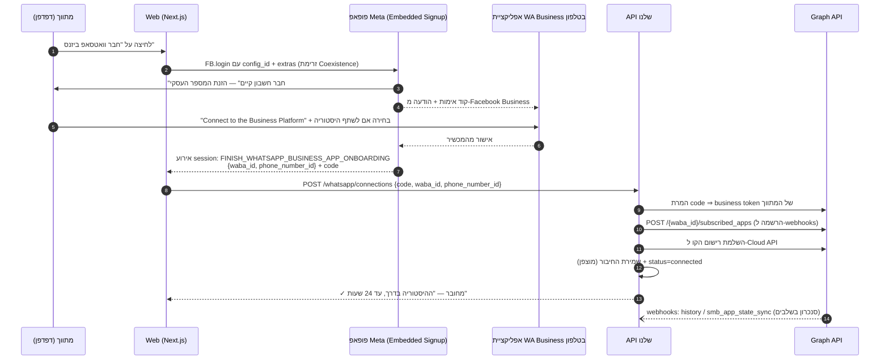
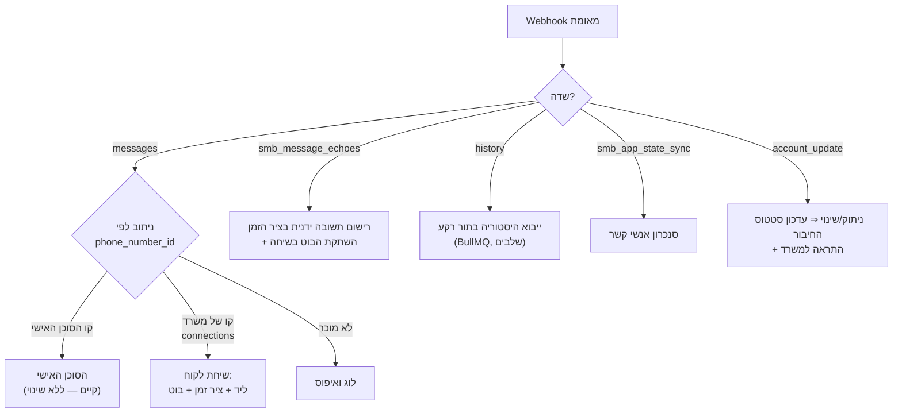

# 12 · וואטסאפ של המתווך — Embedded Signup + Coexistence

תכנון מלא לחיבור **המספר העסקי של כל מתווך** למערכת: בוט מענה ללקוחות
וקליטת פניות דרך ה-Cloud API — **בלי שהמתווך מוותר על אפליקציית
WhatsApp Business במכשיר שלו**. שני הצדדים חיים על אותו מספר במקביל.

> **מונחון קצר:**
> **WABA** — WhatsApp Business Account, החשבון העסקי אצל Meta.
> **Embedded Signup** — פופאפ של Meta שבו הלקוח (המתווך) מחבר את
> המספר שלו לאפליקציה שלנו בכמה קליקים.
> **Coexistence (דו-קיום)** — היכולת של Meta שמאפשרת לאותו מספר לפעול
> **גם** באפליקציית WhatsApp Business בטלפון **וגם** ב-Cloud API.
> **Tech Provider** — הסטטוס שלנו אצל Meta: ספק טכנולוגיה שמחבר
> עסקים אחרים ל-API דרך האפליקציה שלו.

---

## 1. מה בונים — במשפט אחד ובתמונה אחת

המתווך לוחץ אצלנו "חבר וואטסאפ", עובר תהליך קצר של Meta (כולל אישור
בתוך האפליקציה בטלפון) — ומאותו רגע:

- **לקוח שכותב למספר של המתווך** ⇒ ההודעה מגיעה גם אלינו ⇒ בוט עונה,
  נפתח ליד, השיחה נרשמת בציר הזמן.
- **המתווך ממשיך להשתמש באפליקציה בטלפון כרגיל** — עונה ידנית מתי
  שבא לו. תשובה ידנית שלו מגיעה אלינו כהד (echo), נרשמת בציר הזמן,
  **ומשתיקה את הבוט** באותה שיחה — בן-אדם לקח פיקוד.
- **התשלום ל-Meta על הודעות בתשלום** — על חשבון המתווך, באמצעי
  תשלום שהוא מזין ב-WABA *שלו*. אנחנו לא מתווכים כספית מול Meta.



זה בדיוק המסלול שמתואר כ"שלב עתידי" בנספח של
[מדריך ההקמה](whatsapp-setup.md) — כאן הוא מקבל תכנון מלא, בתוספת
רכיב הדו-קיום שמאפשר למתווך להמשיך עם האפליקציה בטלפון.

**מה זה לא:** לא ספריות לא-רשמיות (נדחה ב-[ADR-004](adr/ADR-004-whatsapp.md)),
לא מספר אחד של הפלטפורמה לכל המשרדים, ולא דרישה מהמתווך לנטוש את
האפליקציה. ההחלטה עצמה — [ADR-006](adr/ADR-006-tech-provider-coexistence.md).

---

## 2. אבני היסוד של Meta — מה חייבים לדעת לפני שכותבים שורת קוד

### 2.1 Coexistence — התנאים והגבולות

| נושא | העובדות |
|---|---|
| גרסת אפליקציה | WhatsApp Business **‏2.24.17 ומעלה** בטלפון של המתווך |
| ותק המספר | פעיל באפליקציה **לפחות 7 ימים** (מומלץ חודש-חודשיים — מספר טרי נוטה להיחסם) |
| זמינות גיאוגרפית | ישראל נתמכת. לא נתמך (נכון למועד הכתיבה): EEA/EU, בריטניה ועוד — לוודא מול התיעוד העדכני לפני עבודה עם מספר זר |
| סנכרון היסטוריה | עד **6 חודשים** אחורה, באישור המתווך, בשלושה שלבים (יום 0–1, ימים 1–90, ימים 90–180). מדיה — רק מ-14 הימים האחרונים |
| סנכרון אנשי קשר | כל אנשי הקשר עם מספר וואטסאפ, אם המתווך אישר |
| חלון השלמה | **24 שעות** להשלמת הסנכרון אחרי החיבור — פספוס מחייב ניתוק וחיבור מחדש |
| קצב שליחה | תקרה קבועה של **20 הודעות/שנייה** לקו בדו-קיום (נמוך מקו API רגיל — ולגמרי מספיק למשרד תיווך) |

**מה נכבה אצל המתווך באפליקציה** אחרי החיבור (חובה לומר לו את זה
מראש, במסך החיבור, אחרת זו תלונת תמיכה):

- הודעות נעלמות והודעות "צפייה חד-פעמית" — כבויות בשיחות 1:1
- שיתוף מיקום חי — כבוי
- רשימות תפוצה — הקיימות לקריאה בלבד, אי אפשר ליצור חדשות
- ‏WhatsApp for Windows ו-WearOS — לא נתמכים; מכשירים מקושרים אחרים
  מנותקים בזמן החיבור וניתן לקשר אותם מחדש אחריו

**מה לא מגיע אלינו ל-API** (ולכן הבוט וציר הזמן לא יראו): קבוצות,
שיחות קול/וידאו, סטטוסים, ערוצים, וכלי האפליקציה (קטלוג, תוויות,
תשובות מהירות, הודעות "מחוץ למשרד"). שיחות 1:1 עם לקוחות — שזה
הלב של המוצר — מסונכרנות במלואן, לשני הכיוונים.

### 2.2 חלון 24 השעות והתשלום — מי משלם על מה

הכללים של [מדריך ההקמה](whatsapp-setup.md#כלל-24-השעות) חלים כאן
במלואם, עם טוויסט אחד של דו-קיום:

| מי שולח | עולה כסף? |
|---|---|
| המתווך, ידנית מהאפליקציה בטלפון | **חינם, תמיד** — כמו היום |
| הבוט/המערכת, בתוך 24 שעות מהודעת הלקוח (service) | חינם |
| המערכת, תבנית `utility` בתוך החלון | חינם |
| המערכת, תבנית `marketing` (למשל "נכס חדש שמתאים לך") | **בתשלום — מחויב ל-WABA של המתווך** |
| המערכת, תבנית מחוץ לחלון (כל קטגוריה שאינה service) | לפי מחירון Meta |

**המשמעות המבנית:** כ-Tech Provider, כל מתווך מזין אמצעי תשלום ב-
WhatsApp Manager של ה-WABA שלו, ו-Meta מחייבת אותו ישירות. רק מסלול
Solution Partner (כבד משמעותית: דרישות הכנסה, חוזה עם Meta) מאפשר קו
אשראי משותף. אנחנו **לא** נכנסים לזה בשלב הזה — וזה דווקא יתרון:
אפס סיכון כספי אצלנו, אפס התחשבנות עוברת.

מה שכן חובה עלינו: **לזהות מתי אין אמצעי תשלום**. שליחת תבנית בתשלום
מ-WABA בלי אמצעי תשלום נכשלת בשגיאת חיוב — צריך לתפוס אותה, לסמן את
החיבור "ממתין לאמצעי תשלום", ולהציג למתווך הנחיה + קישור ל-WhatsApp
Manager. בלי זה הוא יראה "המערכת לא שולחת" ולא יבין למה. הודעות
service בתוך החלון עובדות גם בלי אמצעי תשלום — כלומר הבוט הבסיסי
וקליטת הלידים חיים גם אצל מתווך שלא הזין כרטיס.

### 2.3 מה נדרש מאיתנו חד-פעמית מול Meta (הפלטפורמה "מוכנה וקבועה")

זה מה שהופך את האפליקציה לכזו שכל מתווך רק "נכנס אליה". הכול
חד-פעמי, רובו זמן קלנדרי ולא זמן פיתוח, ולכן **מתחילים בו מיד**:

1. **אימות עסק** של Multi Digital ב-Business Manager — כבר מכוסה
   בשלב 2 של [מדריך ההקמה](whatsapp-setup.md).
2. **App Review — Advanced Access** להרשאות
   `whatsapp_business_messaging` ו-`whatsapp_business_management`
   (ו-`business_management` עבור Embedded Signup). דורש סרטון הדגמה
   של הזרימה — ולכן קו הפלטפורמה הקיים (שלבים 1–12 במדריך) הוא
   תנאי מקדים: יש על מה להדגים.
3. **רישום כ-Tech Provider** בתהליך הייעודי של Meta (כולל Access
   Verification). עד להשלמתו מכסת הקליטה היא **10 מתווכים ב-7
   ימים**; אחריו — 200. את הפיילוט אפשר להריץ עוד לפני.
4. **הגדרת Embedded Signup**: יצירת Configuration ב-Facebook Login
   for Business ⇒ מתקבל `config_id` שהפרונט משתמש בו, והפעלת
   **Session Logging** (חובה לזרימת הדו-קיום).
5. **הרחבת מנויי ה-Webhook** של האפליקציה: בנוסף ל-`messages` גם
   `history`, `smb_message_echoes`, `smb_app_state_sync`,
   `account_update`.
6. אפליקציה במצב **Live**.

> ⚠️ **גרסת Embedded Signup:** גרסה 2 יוצאת משימוש ב-15 באוקטובר
> 2026. בונים מהיום על הגרסה העדכנית (v4) — לא נוגעים בישנה.

---

## 3. זרימת החיבור — מה קורה כשהמתווך לוחץ "חבר וואטסאפ"



נקודות שחייבות להיות נכונות בקוד:

- **ההמרה של `code` נעשית בשרת בלבד** (App Secret מעורב). הטוקן
  המתקבל הוא *business integration system-user token* בהיקף העסק של
  המתווך — לא הטוקן של הפלטפורמה. הוא מה שמאפשר לשלוח בשם המתווך
  ולנהל את התבניות שלו, ולכן הוא PII-בדרגת-סוד: מוצפן במנוחה
  (`CryptoService`), לעולם לא בלוג, לעולם לא בצד לקוח.
- **`subscribed_apps` הוא מה שמפנה את ה-webhooks של ה-WABA של
  המתווך אל האפליקציה שלנו.** בלעדיו החיבור "הצליח" ושום הודעה לא
  תגיע — כשל שקט קלאסי. נרשם ללוג עם תוצאת הקריאה.
- **חלון 24 השעות לסנכרון:** אם `history` לא הושלם — מציגים למתווך
  "החיבור לא הושלם, יש לחבר מחדש" ומאפשרים ניתוק+חיבור נקיים.
- **Idempotency:** מתווך שלוחץ פעמיים / רענון באמצע — החיבור נשמר
  לפי `phone_number_id` ייחודי; חיבור חוזר מעדכן את הקיים, לא יוצר
  כפול.

---

## 4. מודל הנתונים

### 4.1 טבלה חדשה: `whatsapp_business_connections`

החיבור של משרד ל-WABA שלו. **כמו `whatsapp_links` — מחוץ ל-RLS**:
נקרא בנתיב הציבורי של ה-Webhook כשעדיין לא ידוע מי הדייר, והוא עצמו
מה שמכריע זאת.

```prisma
/// חיבור וואטסאפ ביזנס של משרד — Embedded Signup + Coexistence (docs/12).
/// מחוץ ל-RLS מאותה סיבה כמו WhatsAppLink: הוא מפתח הניתוב של ה-Webhook.
model WhatsAppBusinessConnection {
  id                    String    @id @db.Char(26)
  tenantId              String    @map("tenant_id") @db.Char(26)
  /// מזהי Meta — יציבים, לא-סודיים, מפתחות הניתוב
  wabaId                String    @map("waba_id") @db.VarChar(32)
  phoneNumberId         String    @unique @map("phone_number_id") @db.VarChar(32)
  /// המספר המוצג — ספרות בלבד (9725...), לתצוגה ולגיבוי ניתוב
  displayPhone          String    @map("display_phone") @db.VarChar(20)
  /// ה-business token של המתווך — הסוד של החיבור, מוצפן במנוחה.
  /// **Nullable בכוונה**: בניתוק הסוד נמחק מיד (null) אבל השורה
  /// נשארת — הסטטוס, הסיבה וההיסטוריה הם מידע שהמשרד צריך לראות.
  /// עמודה חובה הייתה כופה בחירה בין שמירת סוד חי אחרי ניתוק לבין
  /// מחיקת כל המטא-דאטה (ביקורת Codex על התכנון, P1).
  accessTokenEncrypted  String?   @map("access_token_encrypted") @db.Text
  /// pending_history | connected | payment_required | disconnected | error
  status                String    @default("pending_history") @db.VarChar(20)
  /// האם המתווך אישר שיתוף היסטוריה, והיכן הסנכרון עומד
  historyShared         Boolean   @default(false) @map("history_shared")
  historySyncedThrough  DateTime? @map("history_synced_through")
  /// בריאות הקו כפי ש-Meta מדווחת — GREEN/YELLOW/RED + דרגת שליחה
  qualityRating         String?   @map("quality_rating") @db.VarChar(10)
  messagingTier         String?   @map("messaging_tier") @db.VarChar(20)
  connectedAt           DateTime  @default(now()) @map("connected_at")
  disconnectedAt        DateTime? @map("disconnected_at")
  disconnectReason      String?   @map("disconnect_reason") @db.VarChar(40)
  updatedAt             DateTime  @updatedAt @map("updated_at")

  tenant Tenant @relation(fields: [tenantId], references: [id], onDelete: Cascade)

  @@index([tenantId])
  @@index([displayPhone])
  @@map("whatsapp_business_connections")
}
```

משרד יכול להחזיק כמה קווים (סניפים) — לכן `tenantId` אינו ייחודי,
אבל `phoneNumberId` כן: קו אחד שייך לחיבור אחד.

### 4.2 מצב שיחה מול לקוח: `whatsapp_conversations`

הבוט חייב לדעת, פר לקוח-מול-קו: מתי הלקוח כתב לאחרונה (חלון 24
שעות), והאם בן-אדם לקח פיקוד. תחת RLS מלא — נתוני דייר.

```prisma
/// מצב שיחת לקוח על קו של משרד — חלון 24h והשתקת הבוט (docs/12 §6).
model WhatsAppConversation {
  id                 String    @id @db.Char(26)
  tenantId           String    @map("tenant_id") @db.Char(26)
  connectionId       String    @map("connection_id") @db.Char(26)
  contactId          String    @map("contact_id") @db.Char(26)
  /// פתיחת חלון 24 השעות — ההודעה הנכנסת האחרונה מהלקוח
  lastInboundAt      DateTime? @map("last_inbound_at")
  /// המתווך ענה ידנית מהאפליקציה (echo) ⇒ הבוט שותק עד כאן
  botPausedUntil     DateTime? @map("bot_paused_until")
  /// מצב תסריט הבוט (שלב האפיון, תשובות שנאספו) — Json גמיש
  botState           Json      @default("{}") @map("bot_state")
  /// הלקוח ביקש הסרה — הבוט לא יפנה אליו יזום לעולם
  optedOutAt         DateTime? @map("opted_out_at")
  updatedAt          DateTime  @updatedAt @map("updated_at")

  @@unique([connectionId, contactId])
  @@index([tenantId, contactId])
  @@map("whatsapp_conversations")
}
```

### 4.3 שינויים בקיים

- **`Message.provider`** מקבל ערכים חדשים: `coexistence_api` (הבוט
  שלח דרך הקו של המתווך), `coexistence_echo` (המתווך שלח ידנית
  מהאפליקציה — direction=out, נכתב מתוך `smb_message_echoes`)
  ו-`coexistence_history` (הודעה מיובאת מסנכרון ההיסטוריה, ראו §5.3).
- **`Interaction`** — ללא שינוי סכימה. היסטוריה מיובאת **אינה**
  נכתבת לכאן: האילוץ `interaction_exactly_one_parent` מחייב ליד או
  קונה, ולמיובא אין כזה — היא נשמרת כ-`Message` על איש הקשר.
- **ניתוב הדייר ב-`WhatsAppInboundService`** משתדרג: קודם
  `phone_number_id` מול `whatsapp_business_connections` (מפתח יציב,
  באינדקס ייחודי), ורק כ-fallback המנגנון הקיים של
  `settings.whatsappNumber`. שני המנגנונים חיים זה לצד זה — משרדים
  שהוגדרו ידנית ממשיכים לעבוד ללא מגע.

---

## 5. עיבוד ה-Webhook — קו אחד נכנס, ארבעה סוגי מטען

אותו endpoint קיים (`/webhooks/whatsapp`), אותו אימות HMAC — שום
שינוי בשכבת האבטחה. מה שמתרחב הוא הניתוב אחרי האימות:



### 5.1 `messages` — הודעת לקוח נכנסת

הזרימה הקיימת של `ingestMessage` (איש קשר ⇒ ליד פתוח או חדש ⇒
interaction ⇒ אירוע `lead.created`) נשארת הבסיס. נוספים:

- עדכון `WhatsAppConversation.lastInboundAt` (פתיחת חלון 24h).
- הרחבת סוגי ההודעות הנקלטים: תמונה/מסמך/אודיו נשמרים כ-interaction
  עם ירידת מדיה ל-S3 (URL של Meta פג אחרי 5 דקות — ההורדה מיידית,
  בתור).
- הפעלת הבוט (ראו §6) — **בלי `await`**, כמו אצל הסוכן האישי:
  Meta משלחת מחדש אחרי כמה שניות בלי 200.

### 5.2 `smb_message_echoes` — המתווך ענה מהטלפון

הלב של הדו-קיום, ומה שאין לאף פתרון "רגיל" של Cloud API:

1. איתור השיחה לפי הקו + מספר הלקוח.
2. רישום ההודעה בציר הזמן של הליד (`direction: out`,
   `provider: coexistence_echo`) — ההיסטוריה במערכת שלמה גם כשהמתווך
   עובד רק מהטלפון.
3. `botPausedUntil = עכשיו + 6 שעות` — **אדם לקח פיקוד, הבוט
   שותק.** הודעת לקוח חדשה אחרי שהחלון פג מחזירה את הבוט. 6 השעות —
  פרמטר בהגדרות הבוט של המשרד, לא קבוע בקוד.

### 5.3 `history` — ייבוא ההיסטוריה

מגיע בשלבים ויכול להיות גדול (חצי שנה של משרד פעיל) — לכן **תור
BullMQ**, לא בנתיב ה-Webhook:

- כל שיחה ⇒ איש קשר (קיים לפי hash או חדש) + שורות **`Message`**
  (‏`provider: coexistence_history`, `contactId`, חותמת הזמן
  המקורית) — **לא `Interaction`**: האילוץ
  `interaction_exactly_one_parent` דורש ליד או קונה לכל interaction,
  והיסטוריה מיובאת שייכת לאיש הקשר, לא לליד (ביקורת Codex על
  התכנון, P1). ציר הזמן של תיק הלקוח קורא את שני המקורות לפי
  `contactId` ומציג את המיובא עם סימון `[ייבוא]`.
- **לא** נפתחים לידים ולא נורים אירועים מהיסטוריה — ייבוא אינו פנייה
  חדשה, ומשרד לא רוצה 400 "לידים חדשים" ביום החיבור. ההיסטוריה
  נקשרת ללידים רק כשלקוח מיובא כותב שוב.
- דחיית שיתוף (המתווך בחר לא לשתף) מגיעה גם היא ב-`history` — נרשמת,
  `historyShared=false`, וזה לגיטימי לחלוטין.

### 5.4 `account_update` — ניתוק וכיבויים

מתווך יכול לנתק את החיבור מהטלפון בכל רגע. כשמגיע אירוע ניתוק:
`status=disconnected` + `disconnectReason`, התראה לבעלי המשרד,
והבוט מפסיק מיד. שאר עדכוני החשבון (חסימות, שינוי דירוג איכות)
מעדכנים את `qualityRating` ומייצרים התראה בהתאם לחומרה.

---

## 6. הבוט — מענה ללקוחות על הקו של המתווך

הסוכן האישי הקיים (`whatsapp-assistant`) משרת את **המתווך** על קו
הפלטפורמה. הבוט החדש משרת את **הלקוח** על קו המתווך — תפקיד אחר,
מודול אחר, אבל אותה תשתית (AI Services, תורים, ציר זמן).

### 6.1 עקרונות התנהגות

1. **הבוט מציג את עצמו** — "העוזר הדיגיטלי של משרד X". לא מתחזה
   לבן-אדם. (גם דרישת מדיניות של Meta, גם הגינות בסיסית.)
2. **תכליתו איסוף, לא שכנוע**: זיהוי כוונה (קנייה/שכירות/מכירה/אחר)
   ⇒ שאלות אפיון קצרות (אזור, תקציב, חדרים, לוחות זמנים) ⇒ הליד
   מועשר בשדות מובנים ⇒ "המתווך יחזור אליך". שאלה על נכס ספציפי
   (הלקוח הגיע ממודעה) — הבוט משיב מפרטי הנכס דרך ה-API הפנימי של
   Properties, ומציע סיור.
3. **אסקלציה לאדם**: בקשה מפורשת ("תן לי לדבר עם מישהו"), זיהוי
   כעס/תסכול, או שאלה שאין עליה תשובה ⇒ הבוט מפסיק, המשרד מקבל
   התראה "לקוח ממתין לך" עם הקשר מלא.
4. **הד ⇒ שתיקה** (§5.2): המתווך ענה ידנית — הבוט לא מתערב בשיחה.
5. **Opt-out**: "הסר"/"תפסיקו" ⇒ `optedOutAt`, אישור קצר, ואף פנייה
   יזומה לא תישלח. חובת מדיניות Meta והגנה על דירוג האיכות.
6. **שעות פעילות**: מחוץ לשעות שהמשרד הגדיר הבוט עונה מענה מצומצם
   ("נחזור אליך בבוקר") או מושבת — בחירת המשרד.
7. **רק בתוך חלון 24h**: הבוט לעולם אינו יוזם. פניות יזומות (תבניות
   שיווקיות, תזכורות) הן שכבה נפרדת שעוברת דרך Messaging Hub עם
   בקרת תקציב — שלב 4 (§8).

### 6.2 קונפיגורציה פר-משרד

מסך "הבוט שלי" בהגדרות: הפעלה/כיבוי, נוסח פתיחה, שעות פעילות, משך
השתקה אחרי מענה ידני, שאלות האפיון (ברירת מחדל טובה + עריכה), ומתג
"אישור לפני שליחה" למשרדים חשדניים (הבוט מנסח, המתווך מאשר
מהאפליקציה — דרך התראה). כל אלה ב-`botState`/הגדרות המשרד, מאחורי
Feature Flag פר-דייר (הדלקה הדרגתית, כיבוי מיידי בתקלה).

### 6.3 עלות LLM

כל תשובת בוט עוברת דרך AI Services עם רישום שימוש (`AgentEvent`
קיים כבר) — עלות אמיתית פר-משרד נמדדת מהיום הראשון, ומזינה את
התמחור של Billing & Quotas (מכסת הודעות בוט לפי מסלול).

---

## 7. ממשק המשתמש

| מסך | תוכן |
|---|---|
| **הגדרות ⇐ "וואטסאפ ביזנס"** | כרטיס חיבור: מצב נוכחי, כפתור "חבר וואטסאפ" שפותח את פופאפ ה-Embedded Signup (SDK של פייסבוק, `config_id` מהשרת), והסבר קצר של "מה זה עושה ומה נכבה באפליקציה" (רשימת §2.1) **לפני** הלחיצה |
| **אחרי חיבור** | המספר המחובר, סטטוס (מסונכרן/ממתין להיסטוריה/דרוש אמצעי תשלום/מנותק), דירוג איכות, קישור ל-WhatsApp Manager להזנת אמצעי תשלום, כפתור ניתוק |
| **"הבוט שלי"** | קונפיגורציית §6.2 + תצוגה חיה של השיחות האחרונות שהבוט ניהל |
| **ציר הזמן של ליד** | ללא מסך חדש — הודעות בוט, הודעות לקוח והדי-אפליקציה נשזרים בציר הקיים, עם סימון ויזואלי מי כתב (לקוח / בוט / המתווך מהטלפון) |

הזרימה בפרונט: `FB.init` ⇒ `FB.login` עם `config_id` + extras של
זרימת הדו-קיום ⇒ האזנה ל-message event
(`FINISH_WHATSAPP_BUSINESS_APP_ONBOARDING` ⇒ `waba_id`,
`phone_number_id`) ⇒ שליחת ה-`code` לשרת. חשוב: גם זרימת ES רגילה
(מספר חדש, בלי אפליקציה) עובדת מאותו פופאפ — מתווך בלי WhatsApp
Business בטלפון פשוט יקבל קו API רגיל, וזה בסדר גמור.

---

## 8. שלבי ביצוע

**שלב 0 — מקדים מול Meta (זמן קלנדרי, מתחיל היום):** §2.3 במלואו.
תלוי בקו הפלטפורמה הקיים (שלבים 1–12 במדריך ההקמה) כחומר ל-App
Review. בלעדיו שום דבר אחר לא יוצא לאוויר — לכן קודם.

**שלב 1 — חיבור וניתוב (הליבה):** טבלת החיבורים, endpoint להמרת
code ושמירת חיבור, `subscribed_apps`, כרטיס החיבור בהגדרות, ניתוב
inbound לפי `phone_number_id`, קליטת לידים על קו של משרד (בלי בוט).
**כבר בסוף השלב הזה יש ערך:** כל פנייה בוואטסאפ למתווך נכנסת
כליד עם ציר זמן.

**שלב 2 — דו-קיום מלא:** `smb_message_echoes` לציר הזמן + השתקה,
ייבוא `history` בתורים, `smb_app_state_sync`, `account_update`
וניתוק מסודר, מסך הסטטוס המלא.

**שלב 3 — הבוט:** `WhatsAppConversation`, תסריט אפיון + מענה על
נכס, אסקלציה, opt-out, מסך "הבוט שלי", Feature Flag, מדידת עלות.
פיילוט על 2–3 משרדים אמיתיים לפני פתיחה רחבה (מכסת ה-10 של טרום-
Tech-Provider בדיוק מספיקה לפיילוט).

**שלב 4 — שכבה יזומה ומסחור:** ניהול תבניות פר-WABA (יצירה/סטטוס
אישור דרך ה-API עם הטוקן של המתווך), תזכורות ופניות יזומות דרך
Messaging Hub, זיהוי `payment_required`, מכסות ותמחור במסלולים,
דשבורד איכות קו.

**בדיקות לאורך הדרך:** יחידה על הניתוב והמצבים (כמו
`whatsapp-identity.test.ts` הקיים); אינטגרציה עם מטעני webhook
מוקלטים של כל ארבעת השדות; E2E ידני מול מספר בדיקה בזרימת החיבור
המלאה — כולל ניתוק מהטלפון באמצע, פקיעת חלון הסנכרון, וקו בלי
אמצעי תשלום.

---

## 9. סיכונים והתמודדות

| סיכון | התמודדות |
|---|---|
| App Review נדחה / מתארך | להתחיל היום (שלב 0); ההדגמה על קו הפלטפורמה הקיים; בינתיים כל שלב 1 ניתן לפיתוח ובדיקה במצב Development |
| מתווך בלי אמצעי תשלום ⇒ תבניות נכשלות | סטטוס `payment_required` + הנחיה במסך; הבוט וקליטת לידים עובדים גם בלעדיו (service חינם) |
| הבוט מציף ⇒ דירוג איכות יורד ⇒ Meta מגבילה את הקו של המתווך | הבוט רק מגיב, לעולם לא יוזם; opt-out מיידי; ניטור `qualityRating` והתראה בצהוב; "אישור לפני שליחה" כמתג |
| המתווך מנתק מהטלפון בלי להבין | `account_update` ⇒ סטטוס + התראה ברורה "החיבור נותק מהטלפון, כך מחברים מחדש" |
| חלון סנכרון 24h מפוספס | זיהוי ⇒ הנחיית ניתוק+חיבור מחדש במסך הסטטוס |
| שינויי API של Meta (ES v2 נגמר 10/2026) | בנייה על הגרסה העדכנית בלבד; גרסת ה-API של Graph מוצמדת בקונפיג אחד |
| טוקן של מתווך דולף | מוצפן במנוחה, לא בלוגים, גישה דרך שירות אחד; בניתוק — מחיקת הטוקן מיד |
| מספר של מתווך באיחוד האירופי | בדיקת קידומת בזרימת החיבור והודעה ברורה מראש במקום כשל עמום |

## 10. הכרעות מסחריות פתוחות (לא חוסמות את שלבים 0–2)

1. **תמחור** — האם החיבור + בוט הם חלק ממסלול קיים, תוסף בתשלום
   (כמו `whatsapp_seats` הקיים), או לפי שימוש (הודעות בוט)? התשתית
   (מדידת עלות פר-משרד) נבנית כך שכל תשובה אפשרית.
2. **כמה קווים למשרד** — המודל תומך בכמה; האם המסלולים מגבילים?
3. **ברירת מחדל של שיתוף היסטוריה** — ממליצים למתווך לשתף (ציר זמן
   מלא) או לא (פרטיות)? ההמלצה במסך החיבור צריכה ניסוח משפטי קצר.
